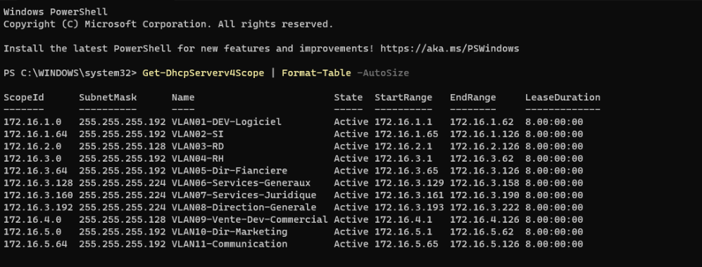
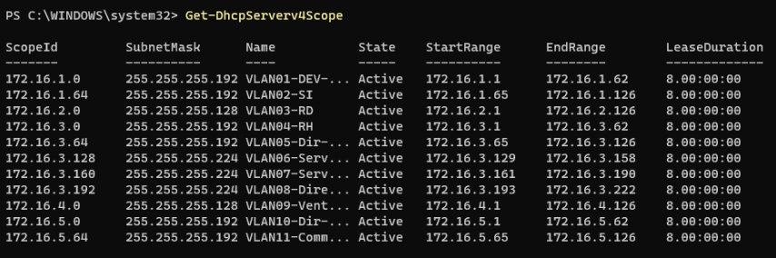
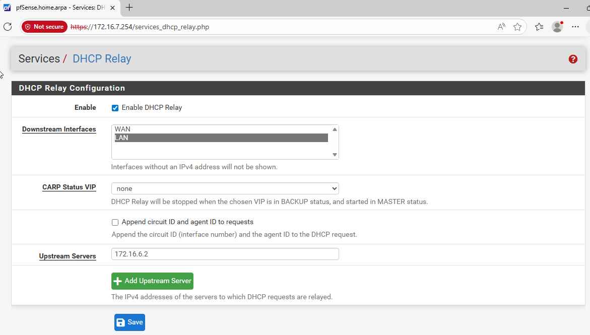

# Configuration DHCP - Pharmgreen

## 1. Création des scopes

### Procédure (à répéter pour chaque VLAN)

1. Ouvrir **Server Manager** → **Tools** → **DHCP**
2. Déplier le serveur → clic droit sur **IPv4** → **New Scope...**

3. Le wizard **New Scope** s'ouvre :
   - **Scope Name** : entrer le nom du VLAN (ex : `VLAN01-DEV-Logiciel`)
   - **IP Address Range** : renseigner la plage de début, fin et le masque
   - **Add Exclusions** : aucune exclusion dans notre cas
   - **Lease Duration** : 8 jours (`8.00:00:00`)
   - **Configure DHCP Options** : choisir **Yes, I want to configure these options now**


4. Options DHCP dans le wizard :
   - **Router (Default Gateway)** : entrer la gateway du VLAN → **Add**
   - **Domain Name and DNS Servers** : `pharmgreen.lan` + `172.16.6.1` → **Add**
   - **WINS Servers** : laisser vide → **Next**

5. **Activate Scope** → **Yes, I want to activate this scope now** → **Finish**

### Tableau des 11 scopes

| Scope ID | Masque | Nom | Plage début | Plage fin | Gateway |
|-|-|-|-|-|-|
| 172.16.1.0 | 255.255.255.192 (/26) | VLAN01-DEV-Logiciel | 172.16.1.1 | 172.16.1.62 | 172.16.1.62 |
| 172.16.1.64 | 255.255.255.192 (/26) | VLAN02-SI | 172.16.1.65 | 172.16.1.126 | 172.16.1.126 |
| 172.16.2.0 | 255.255.255.128 (/25) | VLAN03-RD | 172.16.2.1 | 172.16.2.126 | 172.16.2.126 |
| 172.16.3.0 | 255.255.255.192 (/26) | VLAN04-RH | 172.16.3.1 | 172.16.3.62 | 172.16.3.62 |
| 172.16.3.64 | 255.255.255.192 (/26) | VLAN05-Dir-Financiere | 172.16.3.65 | 172.16.3.126 | 172.16.3.126 |
| 172.16.3.128 | 255.255.255.224 (/27) | VLAN06-Services-Generaux | 172.16.3.129 | 172.16.3.158 | 172.16.3.158 |
| 172.16.3.160 | 255.255.255.224 (/27) | VLAN07-Services-Juridique | 172.16.3.161 | 172.16.3.190 | 172.16.3.190 |
| 172.16.3.192 | 255.255.255.224 (/27) | VLAN08-Direction-Generale | 172.16.3.193 | 172.16.3.222 | 172.16.3.222 |
| 172.16.4.0 | 255.255.255.128 (/25) | VLAN09-Vente-Dev-Commercial | 172.16.4.1 | 172.16.4.126 | 172.16.4.126 |
| 172.16.5.0 | 255.255.255.192 (/26) | VLAN10-Dir-Marketing | 172.16.5.1 | 172.16.5.62 | 172.16.5.62 |
| 172.16.5.64 | 255.255.255.192 (/26) | VLAN11-Communication | 172.16.5.65 | 172.16.5.126 | 172.16.5.126 |

### Résultat

Une fois les 11 scopes créés, la console DHCP affiche :





## 2. Options DHCP spécifiques - PXE Boot (VLAN01 uniquement)

Le scope VLAN01-DEV-Logiciel dispose d'options supplémentaires pour le déploiement PXE via WAPT/WADS (VM 353, 172.16.6.18).

1. Console DHCP → déplier **VLAN01-DEV-Logiciel** → clic droit sur **Scope Options** → **Configure Options...**
2. Cocher et renseigner :

| Option | Nom | Valeur |
|-|-|-|
| 066 | Boot Server Host Name | `172.16.6.18` |
| 067 | Bootfile Name | `http://172.16.6.18/api/v3/baseipxe?uefi=false` |


## 3. DHCP Relay

Le serveur DHCP est en VLAN12 (172.16.6.0/27). Les clients sont dans des VLANs séparés. Des relais DHCP transfèrent les broadcasts DHCP (port 67/68) vers le serveur.

### 3.1 Relais sur routeurs VyOS (CLI)

#### R2 (PG-00000-W00052) - VLAN01 Dev + VLAN02 SI

```
set service dhcp-relay listen-interface eth1
set service dhcp-relay listen-interface eth3
set service dhcp-relay upstream-interface eth0
set service dhcp-relay server 172.16.6.2
commit
save
```

#### R3 (PG-00000-W00053) - VLAN04 RH

```
set service dhcp-relay listen-interface eth1
set service dhcp-relay upstream-interface eth0
set service dhcp-relay server 172.16.6.2
commit
save
```

### 3.2 Relais sur pfSense interne (172.16.7.254)

Pour les VLANs qui transitent par le pfSense (VLANs sans routeur VyOS dédié) :

1. **Services** → **DHCP Relay**
2. Cocher **Enable DHCP Relay**
3. **Downstream Interfaces** : sélectionner `LAN`
4. **Upstream Servers** : `172.16.6.2`
5. Cliquer **Save**



## 4. Vérification

### Via la console DHCP (GUI)

- Déplier un scope → **Address Leases** : vérifier que des baux sont distribués aux clients
- Déplier un scope → **Scope Options** : vérifier les options gateway (003), DNS (006) et domaine (015)


### Via PowerShell (optionnel)

```powershell
# Lister les scopes
Get-DhcpServerv4Scope | Format-Table -AutoSize

# Baux actifs d'un scope
Get-DhcpServerv4Lease -ScopeId 172.16.1.0

# Statistiques
Get-DhcpServerv4ScopeStatistics | Format-Table -AutoSize
```
