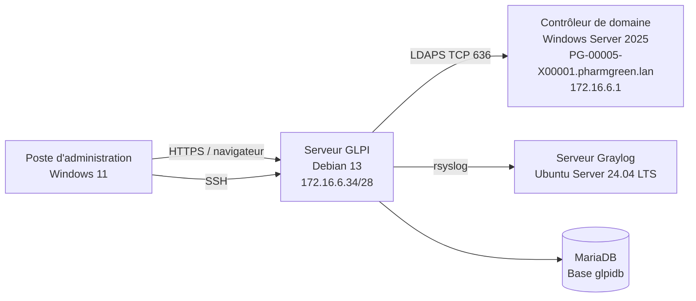

# Configuration de GLPI — Projet 3 Pharmgreen

## 1. Objectif du document

Ce document décrit la **configuration réalisée après l'installation de GLPI** dans le cadre du Projet 3 TSSR de l'entreprise fictive **Pharmgreen**.

L'installation du serveur Debian, du socle LAMP et de l'application GLPI est détaillée dans le fichier `installation.md`.

Le présent document couvre principalement :

- la configuration réseau et l'accès à GLPI ;
- la configuration du VirtualHost Apache ;
- la connexion à l'Active Directory avec LDAP/LDAPS ;
- l'importation et l'authentification des utilisateurs du domaine ;
- l'attribution des profils et des habilitations ;
- la correction du problème donnant le profil `Super-Admin` aux utilisateurs standards ;
- la gestion et la clôture d'un ticket d'incident ;
- les tests de fonctionnement et les commandes de diagnostic ;
- l'envoi des journaux du serveur GLPI vers la solution de centralisation Graylog.

> **Attention :** aucun mot de passe réel ne doit être enregistré dans GitHub. Les secrets sont remplacés par des valeurs comme `<MOT_DE_PASSE>`.

---

## 2. Architecture utilisée



### Paramètres principaux

| Élément | Valeur utilisée |
|---|---|
| Entreprise | Pharmgreen |
| Hyperviseur | Proxmox |
| Système du serveur GLPI | Debian 13 |
| Version de GLPI | GLPI 11 |
| Adresse IP du serveur GLPI | `172.16.6.34/28` |
| VLAN du serveur GLPI | VLAN 13 |
| Serveur web | Apache2 |
| Langage web | PHP 8.4 / PHP-FPM |
| Base de données | MariaDB |
| Nom de la base GLPI | `glpidb` |
| Utilisateur MariaDB | `glpi` |
| Domaine Active Directory | `pharmgreen.lan` |
| Contrôleur de domaine | `PG-00005-X00001.pharmgreen.lan` |
| Adresse du contrôleur de domaine | `172.16.6.1` |
| Protocole d'annuaire final | LDAPS |
| Port LDAPS | TCP `636` |
| Poste d'administration | Windows 11 Pro |

> Le nom d'hôte retenu lors du déploiement du serveur GLPI était `PG-4096-X00001`. Il doit être vérifié avec `hostnamectl` avant la publication définitive de la documentation.

---

## 3. Vérification de la configuration réseau

Avant de configurer GLPI, la connectivité entre le serveur Debian, le contrôleur de domaine et le poste d'administration a été vérifiée.

### Commandes utilisées sur Debian

```bash
ip a
ip route
hostnamectl
ping -c 4 172.16.6.1
getent hosts PG-00005-X00001.pharmgreen.lan
```

### Résultats attendus

- l'interface réseau possède l'adresse `172.16.6.34/28` ;
- une route par défaut est présente ;
- le contrôleur de domaine `172.16.6.1` répond au ping ;
- le nom `PG-00005-X00001.pharmgreen.lan` est résolu par le DNS interne ;
- le poste Windows 11 peut joindre l'interface web de GLPI.

---

## 4. Configuration du VirtualHost Apache

GLPI est publié par Apache à partir du dossier public de l'application :

```text
/var/www/glpi/public
```

Le fichier de configuration du site est situé dans :

```text
/etc/apache2/sites-available/glpi.conf
```

Les éléments importants du VirtualHost sont :

- le nom DNS du service GLPI ;
- le `DocumentRoot` dirigé vers `/var/www/glpi/public` ;
- l'autorisation d'utiliser les règles `.htaccess` ;
- la prise en charge de PHP-FPM ;
- des fichiers de journaux séparés pour GLPI.

Exemple de structure utilisée :

```apache
<VirtualHost *:80>
    ServerName glpi.pharmgreen.lan
    DocumentRoot /var/www/glpi/public

    <Directory /var/www/glpi/public>
        Require all granted
        AllowOverride All
        Options FollowSymLinks
    </Directory>

    ErrorLog ${APACHE_LOG_DIR}/glpi_error.log
    CustomLog ${APACHE_LOG_DIR}/glpi_access.log combined
</VirtualHost>
```

### Activation du site et des modules nécessaires

```bash
sudo a2enmod rewrite proxy_fcgi setenvif
sudo a2ensite glpi.conf
sudo apache2ctl configtest
sudo systemctl reload apache2
```

### Vérification

```bash
sudo systemctl status apache2
sudo ss -lntup | grep -E ':80|:443'
sudo tail -f /var/log/apache2/glpi_error.log
```

Résultat attendu :

```text
Syntax OK
```

et le service Apache doit apparaître en état :

```text
active (running)
```

---

## 5. Droits sur les fichiers de GLPI

Le serveur web Apache doit pouvoir accéder aux fichiers nécessaires au fonctionnement de GLPI.

```bash
sudo chown -R www-data:www-data /var/www/glpi
sudo find /var/www/glpi -type d -exec chmod 755 {} \;
sudo find /var/www/glpi -type f -exec chmod 644 {} \;
```

### Vérification

```bash
ls -ld /var/www/glpi
ls -ld /var/www/glpi/public
```

Le propriétaire attendu est :

```text
www-data www-data
```

---

## 6. Configuration de la base de données dans GLPI

La base de données avait été préparée pendant l'installation avec les paramètres suivants :

| Paramètre | Valeur |
|---|---|
| Serveur SQL | `localhost` |
| Base de données | `glpidb` |
| Utilisateur SQL | `glpi` |
| Mot de passe | `<MOT_DE_PASSE_BASE_GLPI>` |

Le fonctionnement de MariaDB est vérifié avec :

```bash
sudo systemctl status mariadb
sudo mariadb -e "SHOW DATABASES;"
```

Le service doit être en état :

```text
active (running)
```

---

## 7. Liaison de GLPI avec l'Active Directory

### Pourquoi cette liaison a été mise en place

L'objectif est de permettre aux utilisateurs de Pharmgreen :

- de se connecter à GLPI avec leur compte Active Directory ;
- d'éviter la création manuelle de tous les comptes dans GLPI ;
- de centraliser l'authentification ;
- d'attribuer des profils GLPI selon le rôle de l'utilisateur.

### Paramètres de l'annuaire

Dans GLPI :

```text
Configuration > Authentification > Annuaires LDAP
```

Les paramètres utilisés sont les suivants :

| Champ GLPI | Valeur utilisée |
|---|---|
| Nom | `Active Directory Pharmgreen` |
| Serveur | `PG-00005-X00001.pharmgreen.lan` |
| Adresse IP | `172.16.6.1` |
| Port final | `636` |
| Protocole | `LDAPS` |
| BaseDN | `DC=pharmgreen,DC=lan` |
| Champ de connexion | `sAMAccountName` |
| Compte de liaison | `syncglpi` |
| DN du compte de liaison | `CN=syncglpi,OU=T0,OU=Systemes Information,OU=Utilisateurs,OU=Pharmgreen,DC=pharmgreen,DC=lan` |
| Mot de passe | `<MOT_DE_PASSE_COMPTE_SYNC_GLPI>` |

### Test depuis le serveur Debian

Le test LDAP/LDAPS a été effectué avant la validation dans l'interface GLPI.

```bash
ldapsearch -x \
  -H ldaps://PG-00005-X00001.pharmgreen.lan:636 \
  -D "CN=syncglpi,OU=T0,OU=Systemes Information,OU=Utilisateurs,OU=Pharmgreen,DC=pharmgreen,DC=lan" \
  -W \
  -b "DC=pharmgreen,DC=lan" \
  "(objectClass=user)" sAMAccountName
```

L'option `-W` demande le mot de passe sans l'écrire dans la commande ni dans l'historique Bash.

### Résultat obtenu

Le test a retourné :

```text
result: 0 Success
numEntries: 224
```

Cela confirme que :

- le serveur Debian joint le contrôleur de domaine ;
- le nom DNS est résolu ;
- le compte de liaison est reconnu ;
- le BaseDN est correct ;
- la communication avec l'annuaire fonctionne.

---

## 8. Importation des utilisateurs Active Directory

Dans GLPI :

```text
Administration > Utilisateurs > Liaison annuaire LDAP
```

Les utilisateurs ont été recherchés dans l'annuaire Pharmgreen, puis importés dans GLPI.

### Vérifications réalisées

1. rechercher un utilisateur Active Directory dans GLPI ;
2. importer l'utilisateur ;
3. vérifier que sa source d'authentification correspond à l'annuaire Pharmgreen ;
4. se déconnecter du compte administrateur ;
5. se connecter avec l'identifiant Active Directory de l'utilisateur ;
6. vérifier son entité et son profil GLPI.

### Résultat attendu

Un utilisateur importé doit pouvoir se connecter avec :

```text
Identifiant : Uxxxxx
Mot de passe : mot de passe Active Directory
Source : Active Directory Pharmgreen
```

---

## 9. Configuration des profils et des habilitations

### Définitions

- **Profil** : ensemble des droits accordés dans GLPI.
- **Habilitation** : association entre un utilisateur, un profil et une entité.
- **Entité** : périmètre organisationnel dans lequel les droits s'appliquent.

L'entité utilisée dans le projet est :

```text
Entité racine
```

### Profils utilisés

| Type d'utilisateur | Profil GLPI |
|---|---|
| Utilisateur standard | `Self-Service` |
| Technicien | `Technicien` |
| Administrateur GLPI | `Super-Admin` |

---

## 10. Correction de la règle donnant Super-Admin à tous les utilisateurs

### Incident constaté

Après l'importation depuis l'Active Directory, plusieurs utilisateurs standards recevaient automatiquement le profil :

```text
Super-Admin
```

Ils pouvaient donc accéder à des menus et à des fonctions d'administration qui ne correspondaient pas à leur rôle.

### Cause identifiée

La règle d'affectation des habilitations LDAP était trop générale. Elle appliquait le profil `Super-Admin` à tous les utilisateurs provenant de l'annuaire.

### Correction réalisée

Dans GLPI :

```text
Administration > Règles > Règles d'affectation d'habilitations à un utilisateur
```

L'action de la règle générale a été modifiée :

| Paramètre | Ancienne valeur incorrecte | Nouvelle valeur |
|---|---|---|
| Profil attribué | `Super-Admin` | `Self-Service` |
| Entité | `Entité racine` | `Entité racine` |
| Profil par défaut | Profil administratif | `Self-Service` |

### Pourquoi cette correction fonctionne

Tous les utilisateurs de l'annuaire reçoivent maintenant un profil limité leur permettant principalement :

- de créer une demande ;
- de suivre leurs tickets ;
- de consulter les réponses du support ;
- de valider une solution.

Ils ne disposent plus des fonctions d'administration de GLPI.

---

## 11. Cas particulier du compte administratif U00001

Après la correction de la règle générale, le compte `U00001` recevait lui aussi le profil `Self-Service`, car il s'authentifie également avec l'Active Directory.

### Correction appliquée

Dans GLPI :

```text
Administration > Utilisateurs > U00001 > Habilitations
```

Une habilitation statique a été ajoutée :

| Paramètre | Valeur |
|---|---|
| Entité | `Entité racine` |
| Profil | `Super-Admin` |
| Type d'attribution | Manuel / statique |

Le compte `U00001` possède donc deux habilitations :

- `Self-Service (D)` attribué par la règle LDAP ;
- `Super-Admin` ajouté manuellement.

Pour administrer GLPI, l'utilisateur `U00001` sélectionne le profil `Super-Admin` dans le sélecteur de profil situé en haut à droite de l'interface.

---

## 12. Test avec un utilisateur standard

Le compte Active Directory **ROUSSEL GAETAN** a été utilisé pour vérifier la correction.

### Résultat observé

```text
Profil : Self-Service
Entité : Entité racine
```

Le menu d'administration n'était plus visible.

Ce test confirme que l'utilisateur standard peut utiliser le portail de support sans disposer de droits administratifs.

---

## 13. Gestion du profil Technicien

Pour la démonstration du support GLPI, le groupe suivant a été préparé :

```text
Technicien N1
```

Le principe de configuration est le suivant :

| Élément | Valeur |
|---|---|
| Groupe | `Technicien N1` |
| Profil GLPI | `Technicien` |
| Entité | `Entité racine` |

Le profil `Technicien` doit permettre au membre du groupe :

- de consulter les tickets qui lui sont attribués ;
- de prendre en charge un ticket ;
- d'ajouter un suivi ;
- d'enregistrer une solution ;
- de passer le ticket au statut résolu.

> Cette habilitation doit être contrôlée dans `Administration > Utilisateurs > [utilisateur] > Habilitations` avant la démonstration.

---

## 14. Traitement complet d'un ticket d'incident

Un ticket intitulé :

```text
Droits GLPI incorrects après importation Active Directory
```

a été créé afin de tracer l'incident lié aux profils.

### Cycle de traitement utilisé


### Informations renseignées dans le ticket

- description du problème ;
- utilisateur ou comptes concernés ;
- niveau d'impact ;
- technicien affecté ;
- cause identifiée ;
- correction appliquée ;
- tests réalisés ;
- solution finale ;
- validation de l'utilisateur ;
- clôture du ticket.

### Solution enregistrée

```text
La règle d'habilitation LDAP attribuant le profil Super-Admin était trop générale.
La règle a été corrigée afin d'attribuer le profil Self-Service aux utilisateurs standards.
Le profil Super-Admin du compte administratif U00001 a été rétabli manuellement.
Les tests de connexion avec un utilisateur standard et avec U00001 sont conformes.
```

Le ticket a ensuite été passé au statut `Résolu`, validé, puis `Clôturé`.

---

## 15. Centralisation des journaux du serveur GLPI

Le serveur Debian hébergeant GLPI envoie ses journaux vers le serveur de centralisation Graylog avec `rsyslog`.

Cette configuration permet :

- de consulter les événements du serveur GLPI depuis une interface centralisée ;
- de rechercher une erreur Apache, PHP ou système ;
- de filtrer les journaux par machine ;
- de faciliter le diagnostic d'un incident.

### Vérifications utilisées

```bash
sudo systemctl status rsyslog
sudo journalctl -u rsyslog --no-pager -n 50
logger "Test rsyslog depuis le serveur GLPI"
```

Après l'envoi du message de test, celui-ci doit apparaître dans l'entrée ou le stream correspondant au serveur GLPI dans Graylog.

Les détails de l'Input, des streams et des règles Graylog sont documentés dans le dossier consacré à Graylog.

---

## 16. Vérifications générales du serveur GLPI

### État des services

```bash
sudo systemctl status apache2
sudo systemctl status mariadb
sudo systemctl status php8.4-fpm
sudo systemctl status rsyslog
```

### Ports en écoute

```bash
sudo ss -lntup
```

Ports utiles attendus :

| Port | Service |
|---|---|
| TCP 22 | SSH |
| TCP 80 | HTTP |
| TCP 443 | HTTPS, lorsque la publication TLS est activée |
| TCP 3306 en local | MariaDB |
| TCP 636 sortant | LDAPS vers l'Active Directory |

### Ressources système

```bash
df -h
free -h
uptime
```

### Journaux Apache et système

```bash
sudo tail -n 50 /var/log/apache2/glpi_error.log
sudo tail -n 50 /var/log/apache2/glpi_access.log
sudo journalctl -u apache2 --no-pager -n 50
sudo journalctl -u mariadb --no-pager -n 50
```

---

## 17. Erreurs rencontrées et corrections appliquées

### 17.1 Apache ne démarrait pas

#### Symptôme

```text
Job for apache2.service failed
```

#### Cause

Une erreur de syntaxe était présente dans le fichier du site GLPI activé dans `sites-enabled`.

#### Diagnostic

```bash
sudo apache2ctl configtest
sudo journalctl -u apache2 --no-pager -n 50
```

#### Correction

- correction de la directive incorrecte dans `glpi.conf` ;
- vérification du chemin `/var/www/glpi/public` ;
- vérification de la configuration PHP-FPM ;
- nouveau test de syntaxe ;
- redémarrage d'Apache.

```bash
sudo apache2ctl configtest
sudo systemctl restart apache2
```

---

### 17.2 Erreur LDAP `Invalid credentials (49) data 52e`

#### Signification

Le serveur Active Directory était joignable, mais refusait l'authentification du compte de liaison.

#### Cause

Le nom du compte, son DN ou son mot de passe était incorrect.

#### Correction

- contrôle du compte `syncglpi` dans l'Active Directory ;
- utilisation de son DN complet ;
- nouvelle saisie du mot de passe ;
- nouveau test avec `ldapsearch` ;
- validation du test dans GLPI.

---

### 17.3 Tous les utilisateurs étaient Super-Admin

#### Cause

La règle d'habilitation LDAP attribuait le profil `Super-Admin` à tous les utilisateurs importés.

#### Correction

Le profil attribué par la règle générale a été remplacé par :

```text
Self-Service
```

---

### 17.4 U00001 n'était plus Super-Admin

#### Cause

Le compte administratif recevait lui aussi la règle générale `Self-Service`.

#### Correction

Le profil `Super-Admin` a été ajouté manuellement au compte `U00001` dans ses habilitations.

---

## 19. Règles de sécurité appliquées

- ne pas publier les mots de passe dans GitHub ;
- utiliser un compte de service dédié pour la liaison avec l'Active Directory ;
- limiter les droits du compte de liaison à la lecture de l'annuaire ;
- utiliser LDAPS plutôt que LDAP non chiffré ;
- attribuer le principe du moindre privilège dans GLPI ;
- réserver `Super-Admin` aux comptes administratifs ;
- vérifier régulièrement les journaux Apache, PHP, MariaDB et système ;
- conserver une sauvegarde ou un clone avant une modification importante ;
- documenter chaque correction et chaque test.

---


## 22. Conclusion

GLPI est opérationnel sur le serveur Debian 13 et relié à l'Active Directory du domaine `pharmgreen.lan`.

Les utilisateurs peuvent s'authentifier avec leur compte du domaine. Les utilisateurs standards reçoivent le profil `Self-Service`, tandis que le compte administratif `U00001` possède une habilitation `Super-Admin` ajoutée manuellement.

La correction de la règle d'habilitation a supprimé les droits administratifs attribués par erreur aux utilisateurs standards. Le fonctionnement a été vérifié avec plusieurs comptes et tracé dans un ticket d'incident traité jusqu'à sa clôture.
