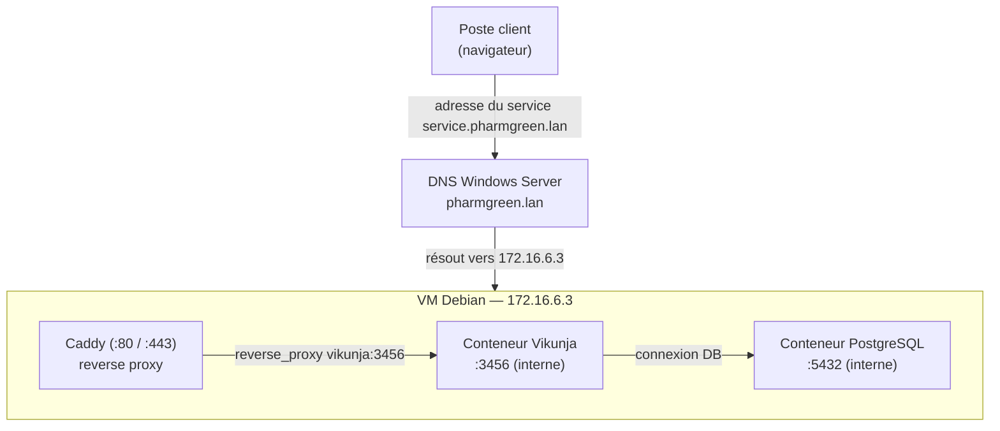
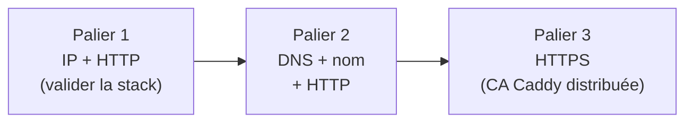

> **Objectif**
> Déployer un intranet via un serveur debian, hébergeant des services en **conteneurs Docker** derrière un **reverse proxy Caddy**, avec accès par **noms de
> domaine** via le **DNS Windows Server** interne (`pharmgreen.lan`).
> Premier service déployé : **Vikunja** (gestion de tâches). Architecture pensée pour ajouter d'autres services (wiki, ticketing) sans rejouer toute la config.

---

## Architecture cible



> **Attention !**
> 
> Deux couches de résolution de noms à ne PAS confondre :
> - **DNS du LAN (Windows Server)** : résout `vikunja.pharmgreen.lan` → `172.16.6.3` (l'IP de la Debian). C'est ici qu'on crée les enregistrements A.
> - **DNS interne Docker** : résout `vikunja` → IP du conteneur, *à l'intérieur* du réseau Docker. C'est ce qui fait marcher `reverse_proxy vikunja:3456`. Windows Server ne connaît pas cette couche.

---

## 1. Installation de Debian

Choix des paquets (écran *Software selection* / tasksel)

| Paquet                     | Choix      | Raison                                                       |
| -------------------------- | ---------- | ------------------------------------------------------------ |
| Debian desktop environment | décocher | Un serveur n'a pas d'interface graphique                     |
| web server                 | décocher | Installerait Apache → **conflit de ports 80/443 avec Caddy** |
| SSH server                 | X cocher   | Indispensable pour le pilotage à distance                    |
| standard system utilities  | X cocher   | Outils de base                                               |


---

## 2. Mise à jour du système

```bash
sudo apt update
sudo apt upgrade -y
```

---

## 3. Installation de Docker (dépôt officiel)

> Astuce : Pourquoi le dépôt officiel plutôt que `docker.io` (dépôt Debian) ?
> Versions plus récentes, maintenues directement par Docker. Meilleur pour un serveur à maintenir dans la durée.

### 3.1 Préparer le dépôt

```bash
# Prérequis HTTPS pour apt
sudo apt update
sudo apt install ca-certificates curl

# Clé GPG officielle (garantit l'authenticité des paquets)
sudo install -m 0755 -d /etc/apt/keyrings
sudo curl -fsSL https://download.docker.com/linux/debian/gpg -o /etc/apt/keyrings/docker.asc
sudo chmod a+r /etc/apt/keyrings/docker.asc

# Ajout du dépôt aux sources apt
sudo tee /etc/apt/sources.list.d/docker.sources <<EOF
Types: deb
URIs: https://download.docker.com/linux/debian
Suites: $(. /etc/os-release && echo "$VERSION_CODENAME")
Components: stable
Architectures: $(dpkg --print-architecture)
Signed-By: /etc/apt/keyrings/docker.asc
EOF

sudo apt update
```

> **Attetion !**
> - **Chemin de la clé** : bien `/etc/apt/keyrings/` (pas `/etc/keyrings/`). Le dossier doit exister (`install -d`).
> - **Rôle de la clé GPG** : elle garantit que les paquets téléchargés proviennent bien de Docker et n'ont pas été altérés (intégrité + authenticité).

### 3.2 Installer les paquets

```bash
sudo apt install docker-ce docker-ce-cli containerd.io docker-buildx-plugin docker-compose-plugin
```

Il y a bien 5 paquets : le moteur (`docker-ce`), le CLI (`docker-ce-cli`), le runtime (`containerd.io`), buildx et surtout **`docker-compose-plugin`** (commande `docker compose`).

### 3.3 Vérifier l'installation

```bash
sudo systemctl status docker
sudo docker run hello-world
```

---

## 4. Arborescence du projet

| Emplacement      | Vocation                           | Pour qui                          |
| ---------------- | ---------------------------------- | --------------------------------- |
| `/opt/intranet/` | logiciels add-on tiers             | acceptable, vu en entreprise      |
| `/srv/intranet/` | **données servies** par la machine | le plus classique pour un serveur |
| `~/intranet/`    | perso                              | simple pour un lab (pas de sudo)  |

Choix retenu : **`/srv/intranet/`** (un serveur qui *sert* une appli).

```bash
sudo mkdir -p /srv/intranet
cd /srv/intranet
```

Arborescence finale :

```text
/srv/intranet/
├── docker-compose.yml
├── Caddyfile
├── db/            # données PostgreSQL (volume)
├── files/         # fichiers Vikunja (volume)
└── caddy-data/    # certificats / CA de Caddy (volume)
```

---

## 6. Caddy — le reverse proxy

**Intérêt de Caddy et du reverse proxy ?**
 - **Point d'entrée unique** : Caddy occupe les ports 80/443. Tous les services restent derrière lui, sans exposer leurs ports sur l'hôte pour des raisons de sécurité
 - **Routage par nom** (virtual hosting) : une seule IP, plusieurs services, distingués par le **nom de domaine** demandé.
 - **URLs propres** : `vikunja.pharmgreen.lan` au lieu de `172.16.6.3:3456`.
 - **TLS centralisé** : un seul endroit gère le HTTPS (CA interne en intranet, Let's Encrypt sur un VPS public).

> **Attention !**
> 
> Caddy (comme Postgres et Vikunja) n'est **pas** installé via `apt`. Il arrive comme **image Docker** déclarée dans le docker-compose. Seul Docker est installé « en dur » sur la Debian.

### Caddyfile — démarrage en HTTP par IP

```caddyfile
:80 {
    reverse_proxy vikunja:3456
}
```

- `:80` (sans nom) → répond à toute requête HTTP, donc accessible par IP.
- `reverse_proxy vikunja:3456` → transmet au conteneur `vikunja` (résolu par le DNS interne Docker) sur son port interne 3456.
-  L'ip est utilisé pour des raisons de test
---

## 7. Vikunja + PostgreSQL via `docker-compose.yml`

Pour installer Vikunja et sa base de données PostgreSQL il est nécessaire de rédiger un fichier docker compose en yaml à l'aide de la commande :

```bash
sudo nano docker-compose.yml
```

Ce fichier se trouvera dans le dossier `/srv/intranet/files`

```yaml
services:
  vikunja:
    image: vikunja/vikunja
    environment:
      VIKUNJA_SERVICE_PUBLICURL: http://172.16.6.3   # IP au début, puis le nom DNS
      VIKUNJA_DATABASE_HOST: db
      VIKUNJA_DATABASE_TYPE: postgres
      VIKUNJA_DATABASE_USER: vikunja
      VIKUNJA_DATABASE_DATABASE: vikunja
      VIKUNJA_DATABASE_PASSWORD: <MDP>               # = POSTGRES_PASSWORD
      VIKUNJA_SERVICE_SECRET: <openssl rand -hex 32> # clé de signature des sessions (indépendante)
    volumes:
      - ./files:/app/vikunja/files
    depends_on:
      db:
        condition: service_healthy
    restart: unless-stopped

  db:
    image: postgres:18
    environment:
      POSTGRES_USER: vikunja
      POSTGRES_DB: vikunja
      POSTGRES_PASSWORD: <MDP>                        # = VIKUNJA_DATABASE_PASSWORD
    volumes:
      - ./db:/var/lib/postgresql                      # ⚠ Postgres 18 : pas /data
    restart: unless-stopped
    healthcheck:
      test: ["CMD-SHELL", "pg_isready -h localhost -U $$POSTGRES_USER"]
      interval: 2s
      start_period: 30s

  caddy:
    image: caddy
    restart: unless-stopped
    ports:
      - "80:80"
      - "443:443"
    depends_on:
      - vikunja
    volumes:
      - ./Caddyfile:/etc/caddy/Caddyfile:ro
      - ./caddy-data:/data
```

A propos de la base de données : Vikunja doit **persister** projets, tâches, utilisateurs… Une base est obligatoire. Choix du moteur : SQLite (1 fichier, simple), **PostgreSQL** (serveur dédié, réaliste — choisi ici) ou MariaDB. Le `VIKUNJA_DATABASE_TYPE`, l'image et les variables doivent **tous désigner le même moteur**.

> **Attention !**
> - `VIKUNJA_DATABASE_PASSWORD` **=** `POSTGRES_PASSWORD` (sinon Vikunja rejeté par la base).
> - `VIKUNJA_SERVICE_SECRET` est **indépendant** (généré par `openssl rand -hex 32`), ce n'est pas un mot de passe DB.
> - Pas de `ports: 3456:3456` sur Vikunja : l'accès passe par Caddy, inutile d'exposer le port → surface d'attaque réduite.
> - Volumes = **persistance**. Sans volume, conteneur supprimé = données perdues.

### Générer le secret

```bash
openssl rand -hex 32
```

### Lancer

```bash
sudo docker compose up -d
sudo docker compose ps
```

---

## 8. Points d'attention complémentaires

### 8.1 Volume PostgreSQL 18

Postgres **18+** veut le montage sur `/var/lib/postgresql` (pas `/var/lib/postgresql/data`). Sinon le conteneur reste `unhealthy` : Vikunja ne démarre pas (dépendance).

**Correction propre :**
```bash
 sudo docker compose down
sudo rm -rf /srv/intranet/db     # supprimer la base en cas de mauvaise installation
# corriger le volume dans le compose
sudo docker compose up -d
```

### 8.2 Permissions du volume `files` (crash-loop Vikunja)

Erreur : `permission denied … [process uid=1000 gid=0, dir owner uid=0 gid=0]`.
Le dossier `files`, créé par root (via `sudo`), n'est pas accessible à l'utilisateur interne de Vikunja (Dans notre cas `uid=1000`).
**Correction (moindre privilège — NE PAS passer le service en root) :**
```bash
sudo docker compose down
sudo chown -R 1000:1000 /srv/intranet/files
sudo docker compose up -d
```

Postgres n'a pas ce souci car son processus tourne en root dans son conteneur.

### Diagnostic — toujours lire les logs avant de corriger

```bash
sudo docker compose logs db
sudo docker compose logs vikunja
sudo docker compose logs caddy
curl -I http://localhost        # teste la chaîne depuis la Debian (court-circuite le réseau client)
```

---

## 9. Passage aux noms : modification du DNS Windows Server

> Domaine interne : `pharmgreen.lan` (Active Directory intégré)
### 9.1 Créer les enregistrements A

DNS Manager → `Forward Lookup Zones` → clic droit sur **`pharmgreen.lan`** → **New Host (A or AAAA)** :

| Name (host) | Type | Valeur |
|---|---|---|
| `intranet` | A | `172.16.6.3` |
| `vikunja` | A | `172.16.6.3` |
| `wiki` | A | `172.16.6.3` |
| `tickets` | A | `172.16.6.3` |

Structure des noms :

Tous les services sont **frères**, directement sous `pharmgreen.lan` : vikunja.pharmgreen.lan`, `wiki.pharmgreen.lan`…

Test sur le server Windows :
```powershell
nslookup vikunja.pharmgreen.lan 127.0.0.1   # doit retourner 172.16.6.3
```

### 9.3 Adapter le Caddyfile (bloc nommé)

```caddyfile
http://vikunja.pharmgreen.lan {
    reverse_proxy vikunja:3456
}
```

**Préfixe `http://`:**
Dès qu'on met un **nom** (au lieu de `:80`), Caddy veut faire du **HTTPS automatique** (CA interne). Le préfixe `http://` force le HTTP en clair pour l'instant. Le HTTPS (palier 3) viendra avec la distribution de la CA de Caddy sur les postes clients.

```bash
sudo docker compose restart caddy
```

### 9.3 Mettre à jour l'URL publique de Vikunja dans le docker-compose

```yaml
VIKUNJA_SERVICE_PUBLICURL: http://vikunja.pharmgreen.lan
```

```bash
sudo docker compose up -d
```

### 9.4 Côté client

Le poste client doit utiliser **le DNS Windows Server** comme résolveur (pas `8.8.8.8` directement), sinon `*.pharmgreen.lan` ne résout pas.

Test final depuis le client dans le navigateur :

```text
http://vikunja.pharmgreen.lan
```

---

## 10. Ajouter un nouveau service (pattern réutilisable)

Pour chaque nouveau service (wiki, ticketing…) :

1. **Docker-Compose** : ajouter un bloc `service:` (image, volumes, `restart`).
2. **DNS** : créer un enregistrement A `<service>.pharmgreen.lan` → `172.16.6.3`.
3. **Caddyfile** : ajouter un bloc
   ```caddyfile
   http://<service>.pharmgreen.lan {
       reverse_proxy <service>:<port_interne>
   }
   ```
4. `sudo docker compose up -d` + `sudo docker compose restart caddy`.
5. **Valider** ce service avant de passer au suivant.

## 11. Portail intranet

`intranet.pharmgreen.lan` servira une page d'accueil (HTML maison ou dashboard type **Homepage / Dashy / Homarr**) regroupant des liens vers tous les services. À faire en dernier, une fois les services en place.

---

## Méthode :



> Principe fondamental :
> Un palier à la fois, on valide avant d'empiler. Lire les **logs** avant de corriger. Ne jamais débugger plusieurs nouveaux services en même temps.

---
