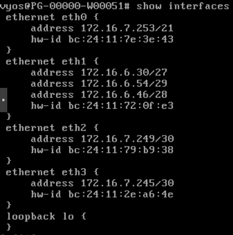
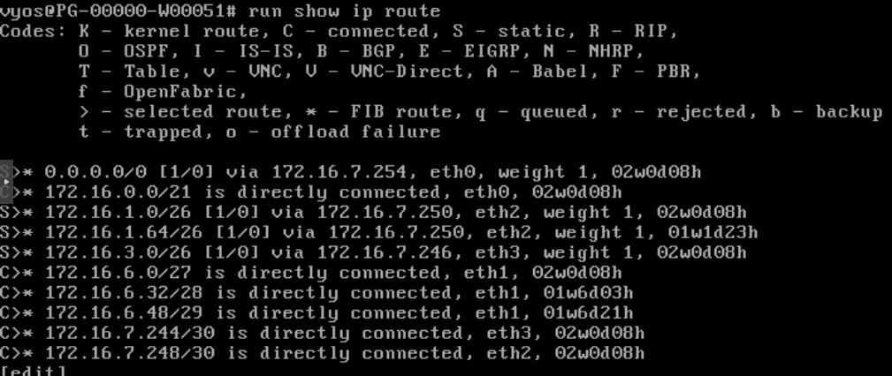
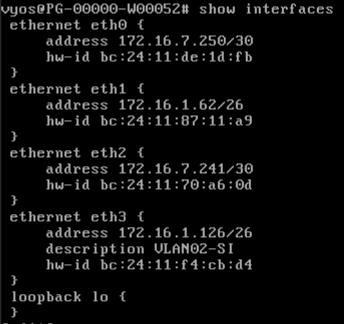
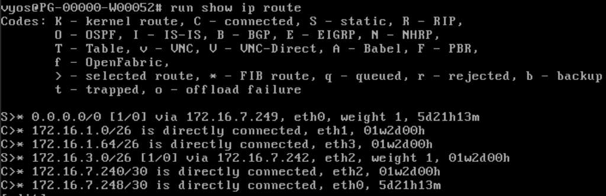
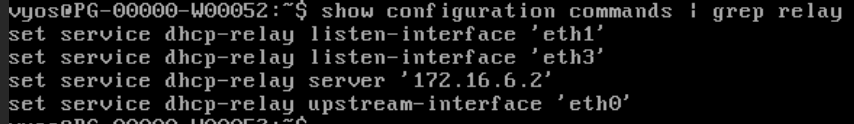
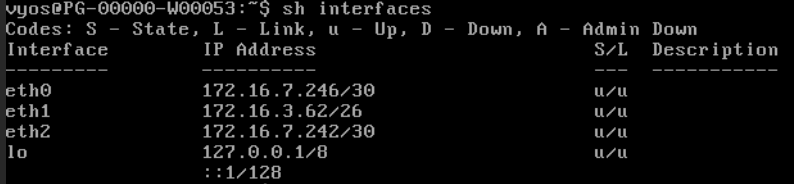
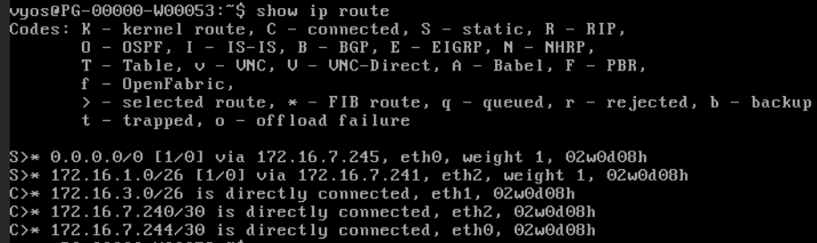
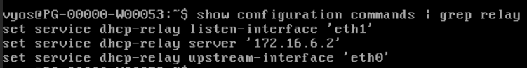

# Configuration du routage - Pharmgreen

## 1. R1 - Routeur central (PG-00000-W00051)

R1 est le point central du réseau. Il connecte les VLANs serveurs, le pfSense et les routeurs R2/R3.

### 1.1 Interfaces

```
configure

# eth0 - vers pfSense
set interfaces ethernet eth0 address 172.16.7.253/21

# eth1 - VLAN12 Serveurs prod (gateway)
set interfaces ethernet eth1 address 172.16.6.30/27

# eth1 - VLAN14 Bastion (adresse secondaire)
set interfaces ethernet eth1 address 172.16.6.54/29

# eth1 - VLAN13 Serveurs admin (adresse secondaire)
set interfaces ethernet eth1 address 172.16.6.46/28

# eth2 - lien vers R2
set interfaces ethernet eth2 address 172.16.7.249/30

# eth3 - lien vers R3
set interfaces ethernet eth3 address 172.16.7.245/30

commit
save
```



### 1.2 Routes statiques

```
configure

# Route par défaut vers pfSense
set protocols static route 0.0.0.0/0 next-hop 172.16.7.254

# VLAN01 Dev via R2
set protocols static route 172.16.1.0/26 next-hop 172.16.7.250

# VLAN02 SI via R2
set protocols static route 172.16.1.64/26 next-hop 172.16.7.250

# VLAN04 RH via R3
set protocols static route 172.16.3.0/26 next-hop 172.16.7.246

commit
save
```



---

## 2. R2 - Gateway VLAN01 Dev + VLAN02 SI (PG-00000-W00052)

### 2.1 Interfaces

```
configure

# eth0 - lien vers R1
set interfaces ethernet eth0 address 172.16.7.250/30

# eth1 - VLAN01 Dev (gateway)
set interfaces ethernet eth1 address 172.16.1.62/26

# eth2 - lien vers R3
set interfaces ethernet eth2 address 172.16.7.241/30

# eth3 - VLAN02 SI (gateway)
set interfaces ethernet eth3 address 172.16.1.126/26
set interfaces ethernet eth3 description "VLAN02-SI"

commit
save
```



### 2.2 Routes statiques

```
configure

# Route par défaut via R1
set protocols static route 0.0.0.0/0 next-hop 172.16.7.249

# VLAN04 RH via R3
set protocols static route 172.16.3.0/26 next-hop 172.16.7.242

commit
save
```



### 2.3 DHCP Relay

R2 relaie les requêtes DHCP des clients VLAN01 (eth1) et VLAN02 (eth3) vers le serveur DHCP (172.16.6.2).

```
configure

set service dhcp-relay listen-interface eth1
set service dhcp-relay listen-interface eth3
set service dhcp-relay upstream-interface eth0
set service dhcp-relay server 172.16.6.2

commit
save
```



---

## 3. R3 - Gateway VLAN04 RH (PG-00000-W00053)

### 3.1 Interfaces

```
configure

# eth0 - lien vers R1
set interfaces ethernet eth0 address 172.16.7.246/30

# eth1 - VLAN04 RH (gateway)
set interfaces ethernet eth1 address 172.16.3.62/26

# eth2 - lien vers R2
set interfaces ethernet eth2 address 172.16.7.242/30

commit
save
```



### 3.2 Routes statiques

```
configure

# Route par défaut via R1
set protocols static route 0.0.0.0/0 next-hop 172.16.7.245

# VLAN01 Dev via R2
set protocols static route 172.16.1.0/26 next-hop 172.16.7.241

commit
save
```



### 3.3 DHCP Relay

R3 relaie les requêtes DHCP des clients VLAN04 (eth1) vers le serveur DHCP (172.16.6.2).

```
configure

set service dhcp-relay listen-interface eth1
set service dhcp-relay upstream-interface eth0
set service dhcp-relay server 172.16.6.2

commit
save
```



---

## 4. pfSense interne (172.16.7.254) - Routes statiques

Le pfSense interne a un masque /21 sur son interface LAN, ce qui couvre tout le réseau 172.16.0.0/21. Sans routes statiques, le pfSense tente de joindre les sous-réseaux VLAN directement au lieu de passer par R1. Les routes statiques corrigent ce comportement.

### 4.1 Gateway vers R1

**System > Routing > Gateways** → **Add** :

| Champ | Valeur |
|-|-|
| Interface | LAN |
| Name | R1VyOS |
| Gateway | 172.16.7.253 |


### 4.2 Routes statiques

**System > Routing > Static Routes** → **Add** pour chaque VLAN :

| Réseau | Gateway | Description |
|-|-|-|
| 172.16.1.0/26 | R1VyOS - 172.16.7.253 | VLAN01-DEV-VIA-R1 |
| 172.16.3.0/26 | R1VyOS - 172.16.7.253 | VLAN04-RH-VIA-R1 |


> **Note** : la route pour VLAN02 SI (172.16.1.64/26 via R1) est aussi configurée mais n'apparaît pas sur cette capture.

## 5. Vérification

### Sur les routeurs VyOS

```
# Table de routage
show ip route

# Interfaces et IPs
show interfaces

# Config DHCP relay
show configuration commands | grep relay
```

### Tests de connectivité

```
# Depuis R1 : ping R2
ping 172.16.7.250

# Depuis R1 : ping R3
ping 172.16.7.246

# Depuis un client VLAN01 : ping serveur VLAN12
ping 172.16.6.1

# Depuis un client VLAN04 : ping serveur VLAN12
ping 172.16.6.1
```
