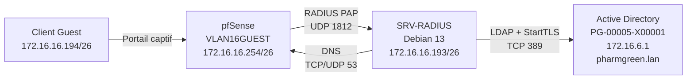

# Configuration de FreeRADIUS, Active Directory et pfSense

## 1. Objectif

Cette documentation décrit la configuration réalisée dans le cadre du **Projet 3 TSSR Pharmgreen** pour :

- utiliser un serveur **FreeRADIUS** sous Debian 13 ;
- déclarer le pare-feu **pfSense** comme client RADIUS ;
- authentifier les utilisateurs avec leur compte **Active Directory** ;
- appliquer une durée de connexion de cinq minutes aux membres du groupe `GrpAccesInternetRestreint` ;
- utiliser cette authentification avec le portail captif du réseau invité.

L’installation de Debian et des paquets FreeRADIUS est décrite dans le fichier `installation.md`.

> **Important :** les mots de passe et les secrets partagés ne doivent jamais être publiés sur GitHub. Ils sont remplacés dans ce document par des valeurs entre chevrons.

---

## 2. Pourquoi cette configuration ?

Le portail captif pfSense sait afficher une page de connexion, mais il ne connaît pas directement les comptes du domaine Active Directory.

FreeRADIUS joue donc le rôle d’intermédiaire :

1. l’utilisateur saisit son identifiant et son mot de passe sur le portail captif ;
2. pfSense envoie la demande à FreeRADIUS ;
3. FreeRADIUS recherche l’utilisateur dans Active Directory ;
4. Active Directory vérifie le mot de passe ;
5. FreeRADIUS renvoie à pfSense une réponse d’acceptation ou de refus ;
6. pour le groupe restreint, FreeRADIUS ajoute `Session-Timeout = 300` ;
7. pfSense coupe la session après 300 secondes, soit cinq minutes.

---

## 3. Architecture utilisée



---

## 4. Paramètres de l’environnement

| Élément | Valeur |
|---|---|
| Hyperviseur | Proxmox |
| Serveur RADIUS | `SRV-RADIUS` |
| Système | Debian 13 |
| Adresse du serveur RADIUS | `172.16.16.193/26` |
| Bridge Proxmox | `vmbr316` |
| Interface pfSense | `VLAN16GUEST` |
| Adresse pfSense Guest | `172.16.16.254/26` |
| Plage DHCP Guest | `172.16.16.194` à `172.16.16.253` |
| Contrôleur de domaine | `PG-00005-X00001.pharmgreen.lan` |
| Adresse du contrôleur de domaine | `172.16.6.1` |
| Domaine Active Directory | `pharmgreen.lan` |
| Port RADIUS | UDP `1812` |
| Port LDAP avec StartTLS | TCP `389` |
| Ports DNS | TCP/UDP `53` |
| Utilisateur de test validé | `U00180` |
| Groupe limité | `GrpAccesInternetRestreint` |
| Durée de session limitée | `300` secondes |

---


# Partie A — Configuration de pfSense avant FreeRADIUS

## 6. Vérification du réseau Guest

Dans pfSense :

```text
Services > DHCP Server > VLAN16GUEST
```

Paramètres utilisés :

| Paramètre | Valeur |
|---|---|
| Interface | `VLAN16GUEST` |
| Adresse de la passerelle | `172.16.16.254/26` |
| Début de plage DHCP | `172.16.16.194` |
| Fin de plage DHCP | `172.16.16.253` |

L’adresse `172.16.16.193` du serveur FreeRADIUS doit rester en dehors de la plage DHCP.

---

## 7. Exemption du serveur FreeRADIUS dans le portail captif

Le serveur FreeRADIUS est placé sur le réseau Guest. Il doit pouvoir joindre le DNS et l’Active Directory sans être lui-même bloqué par le portail captif.

Dans pfSense :

```text
Services > Captive Portal > zone du réseau Guest
```

Dans la partie **Allowed IP Addresses**, ajouter :

| Champ | Valeur |
|---|---|
| Adresse | `172.16.16.193/32` |
| Direction | `From` |
| Description | `SRV-RADIUS` |

Cette exemption autorise le trafic provenant du serveur FreeRADIUS sans demander une authentification sur le portail captif.

---

## 8. Règles de pare-feu nécessaires

Dans pfSense :

```text
Firewall > Rules > VLAN16GUEST
```

Autoriser au minimum le serveur FreeRADIUS à joindre le contrôleur de domaine.

### Règle DNS

| Champ | Valeur |
|---|---|
| Action | Pass |
| Interface | VLAN16GUEST |
| Protocole | TCP/UDP |
| Source | `172.16.16.193` |
| Destination | `172.16.6.1` |
| Port destination | `53` |
| Description | `SRV-RADIUS vers DNS AD` |

### Règle LDAP avec StartTLS

| Champ | Valeur |
|---|---|
| Action | Pass |
| Interface | VLAN16GUEST |
| Protocole | TCP |
| Source | `172.16.16.193` |
| Destination | `172.16.6.1` |
| Port destination | `389` |
| Description | `SRV-RADIUS vers LDAP AD` |

Pour le diagnostic, une règle ICMP temporaire peut être utilisée afin de tester le ping vers le contrôleur de domaine.

### Vérifications depuis Debian

```bash
ping -c 4 172.16.6.1
getent hosts PG-00005-X00001.pharmgreen.lan
nc -zv PG-00005-X00001.pharmgreen.lan 389
```

Résultats attendus :

- l’adresse du contrôleur de domaine est joignable ;
- son nom DNS est résolu ;
- le port TCP 389 répond.

---

# Partie B — Configuration de FreeRADIUS

## 9. Sauvegarde des fichiers avant modification

Avant chaque modification :

```bash
sudo cp -a \
  /etc/freeradius/3.0 \
  /etc/freeradius/3.0.sauvegarde-avant-configuration
```

Vérification :

```bash
sudo ls -ld /etc/freeradius/3.0*
```

---

## 10. Déclaration de pfSense comme client RADIUS

Modifier le fichier :

```bash
sudo nano /etc/freeradius/3.0/clients.conf
```

Ajouter :

```text
client pfsense_vlan16 {
    ipaddr = 172.16.16.254
    secret = <SECRET_PARTAGE>
    shortname = pfsense-vlan16
    nas_type = other
}
```

### Explication

| Directive | Rôle |
|---|---|
| `ipaddr` | adresse de l’équipement autorisé à interroger FreeRADIUS |
| `secret` | secret identique dans pfSense et FreeRADIUS |
| `shortname` | nom lisible dans les journaux |
| `nas_type` | type générique d’équipement réseau |

> Le secret doit être long, aléatoire et différent d’un mot de passe utilisateur.

---

## 11. Configuration du module LDAP

Modifier :

```bash
sudo nano /etc/freeradius/3.0/mods-available/ldap
```

Configuration utilisée dans le laboratoire :

```text
ldap {
    server = 'ldap://PG-00005-X00001.pharmgreen.lan'
    port = 389

    identity = 'CN=Administrator,CN=Users,DC=pharmgreen,DC=lan'
    password = '<MOT_DE_PASSE_BIND>'

    base_dn = 'DC=pharmgreen,DC=lan'

    user {
        base_dn = "${..base_dn}"
        filter = "(&(objectClass=user)(sAMAccountName=%{%{Stripped-User-Name}:-%{User-Name}}))"
    }

    group {
        base_dn = "${..base_dn}"
        filter = '(objectClass=group)'
        scope = 'sub'
        name_attribute = cn
        membership_attribute = 'memberOf'
        cacheable_name = 'no'
        cacheable_dn = 'no'
    }

    tls {
        start_tls = yes
        require_cert = 'never'
    }

    options {
        chase_referrals = no
        rebind = no
    }
}
```

### Rôle des principaux paramètres

| Paramètre | Pourquoi il est utilisé |
|---|---|
| `server` | désigne le contrôleur de domaine |
| `port = 389` | utilise LDAP avec passage en StartTLS |
| `identity` | compte utilisé pour rechercher les utilisateurs |
| `base_dn` | point de départ des recherches dans l’annuaire |
| `sAMAccountName` | permet une connexion avec un identifiant comme `U00180` |
| `memberOf` | permet de lire les groupes de l’utilisateur |
| `start_tls = yes` | chiffre la communication LDAP |
| `chase_referrals = no` | évite les redirections vers `ForestDnsZones` et `DomainDnsZones` |
| `rebind = no` | évite un nouveau bind automatique lors d’une redirection |

---

## 12. Activation du module LDAP

Vérifier si le lien existe :

```bash
ls -l /etc/freeradius/3.0/mods-enabled/ldap
```

S’il n’existe pas, créer le lien :

```bash
sudo ln -s \
  /etc/freeradius/3.0/mods-available/ldap \
  /etc/freeradius/3.0/mods-enabled/ldap
```

---

## 13. Test LDAP depuis Debian

Tester la recherche de l’utilisateur :

```bash
ldapsearch \
  -H ldap://PG-00005-X00001.pharmgreen.lan \
  -ZZ \
  -x \
  -D 'CN=Administrator,CN=Users,DC=pharmgreen,DC=lan' \
  -W \
  -b 'DC=pharmgreen,DC=lan' \
  '(sAMAccountName=U00180)' \
  sAMAccountName memberOf
```

### Résultats attendus

La sortie doit contenir :

```text
sAMAccountName: U00180
```

et une ligne `memberOf` contenant :

```text
CN=GrpAccesInternetRestreint
```

---

## 14. Activation de l’authentification LDAP

Modifier :

```bash
sudo nano /etc/freeradius/3.0/sites-enabled/default
```

### Section `authorize`

Vérifier que l’appel au module LDAP est actif :

```text
ldap
```

Après l’appel au module LDAP, ajouter :

```text
if ((ok || updated) && User-Password && !control:Auth-Type) {
    update control {
        &Auth-Type := LDAP
    }
}
```

Cette règle indique à FreeRADIUS que le mot de passe doit être vérifié par Active Directory.

---

## 15. Application de la limite de cinq minutes

Toujours dans la section `authorize`, ajouter :

```text
if (LDAP-Group == "GrpAccesInternetRestreint") {
    update reply {
        Session-Timeout := 300
    }
}
```

### Pourquoi ?

`Session-Timeout` est un attribut RADIUS envoyé à pfSense.

```text
300 secondes ÷ 60 = 5 minutes
```

Seuls les membres du groupe `GrpAccesInternetRestreint` reçoivent cette limite.

Le groupe `GrpAccesInternetComplet` ne reçoit pas cette valeur dans la configuration validée. Il reste donc soumis aux paramètres généraux du portail captif.

---

## 16. Section `authenticate`

Dans la section `authenticate`, vérifier ou ajouter :

```text
Auth-Type LDAP {
    ldap
}
```

---

## 17. Vérification de la syntaxe

Avant chaque redémarrage :

```bash
sudo freeradius -XC
```

Résultat attendu :

```text
Configuration appears to be OK
```

En cas d’erreur, la commande indique généralement le fichier et la ligne à corriger.

---

## 18. Lancement en mode diagnostic

Arrêter d’abord le service normal :

```bash
sudo systemctl stop freeradius
sudo pgrep -a freeradius
```

Lancer ensuite :

```bash
sudo freeradius -X
```

Résultat attendu au démarrage :

```text
Ready to process requests
```

Laisser cette fenêtre ouverte pendant les tests depuis pfSense.

### Messages recherchés pendant une authentification réussie

```text
User object found
Found Auth-Type = LDAP
Bind as user ... was successful
LDAP-Group ... GrpAccesInternetRestreint ... TRUE
Session-Timeout := 300
Sent Access-Accept
```

Après les tests :

```text
Ctrl + C
```

Puis relancer le service :

```bash
sudo systemctl start freeradius
sudo systemctl status freeradius --no-pager
```

---

# Partie C — Déclaration de FreeRADIUS dans pfSense

## 19. Création du serveur d’authentification

Dans pfSense :

```text
System > User Manager > Authentication Servers
```

Cliquer sur **Add**, puis renseigner :

| Champ | Valeur |
|---|---|
| Descriptive name | `RADIUS-SRV` |
| Type | `RADIUS` |
| Protocol | `PAP` |
| Hostname or IP address | `172.16.16.193` |
| Shared Secret | `<SECRET_PARTAGE>` |
| Services offered | `Authentication` |
| Authentication port | `1812` |
| NAS IP Attribute | interface `VLAN16GUEST` / `172.16.16.254` |

Le secret doit être strictement identique à celui déclaré dans `clients.conf`.

---

## 20. Test depuis pfSense

Dans pfSense :

```text
Diagnostics > Authentication
```

Sélectionner :

```text
Authentication Server : RADIUS-SRV
```

Tester d’abord un compte fonctionnel, puis `U00180`.

Résultat attendu :

```text
User U00180 authenticated successfully
```

Dans la console `freeradius -X`, vérifier :

```text
Bind as user ... was successful
Sent Access-Accept
```

---

# Partie D — Configuration du portail captif pfSense

## 21. Sélection du serveur RADIUS

Dans pfSense :

```text
Services > Captive Portal > zone liée à VLAN16GUEST
```

Configurer :

| Paramètre | Valeur |
|---|---|
| Authentication Method | `Use an Authentication backend` |
| Authentication Server | `RADIUS-SRV` |
| Secondary Authentication Server | aucun |
| Reauthenticate Users | décoché pendant le test |
| RADIUS Session-Timeout | activé |
| Idle Timeout | vide pendant le test |
| Hard Timeout | vide pendant le test |

L’absence d’`Idle Timeout` et de `Hard Timeout` permet de vérifier que la coupure provient bien de l’attribut envoyé par FreeRADIUS.

---

## 22. Vérification du client Guest

Sur le poste Windows connecté au réseau Guest :

```powershell
ipconfig /release
ipconfig /renew
ipconfig /all
```

Configuration attendue :

| Paramètre | Valeur |
|---|---|
| Adresse IPv4 | `172.16.16.194/26` ou une autre adresse de la plage |
| Masque | `255.255.255.192` |
| Passerelle | `172.16.16.254` |
| DNS | `172.16.16.254` |

---

## 23. Déclenchement du portail captif

Ouvrir le navigateur.

Lorsque le portail ne s’affiche pas automatiquement, ouvrir une page en HTTP :

```text
http://neverssl.com
```

### Pourquoi NeverSSL ?

Un site HTTPS chiffre immédiatement la communication. pfSense ne peut pas toujours le rediriger proprement vers le portail captif.

NeverSSL utilise HTTP et permet à pfSense d’effectuer la redirection vers la page de connexion.

---

## 24. Test final avec U00180

1. Ouvrir le portail captif.
2. Saisir l’identifiant `U00180`.
3. Saisir le mot de passe Active Directory.
4. Valider la connexion.
5. Dans pfSense, ouvrir :

```text
Status > Captive Portal
```

6. Vérifier que la session de `U00180` est visible.
7. Vérifier dans `freeradius -X` :

```text
LDAP-Group == "GrpAccesInternetRestreint" -> TRUE
Session-Timeout = 300
Sent Access-Accept
```

8. Attendre cinq minutes.
9. Actualiser la page **Status > Captive Portal**.
10. Vérifier que la session a disparu.
11. Ouvrir de nouveau `http://neverssl.com`.
12. Vérifier que le portail captif demande une nouvelle authentification.

---

# Partie E — Tests et diagnostic

## 25. Tableau de validation

| Test | Outil ou commande | Résultat validé ou attendu |
|---|---|---|
| Réseau Debian | `ip -br a` | `172.16.16.193/26` |
| Passerelle | `ip route` | via `172.16.16.254` |
| DNS AD | `getent hosts PG-00005-X00001.pharmgreen.lan` | résolution vers `172.16.6.1` |
| Port LDAP | `nc -zv ... 389` | connexion réussie |
| Syntaxe FreeRADIUS | `freeradius -XC` | `Configuration appears to be OK` |
| Service | `systemctl status freeradius` | `active (running)` |
| Authentification pfSense | Diagnostics > Authentication | utilisateur authentifié |
| Bind Active Directory | `freeradius -X` | `Bind as user ... was successful` |
| Groupe AD | `freeradius -X` | groupe restreint détecté |
| Réponse RADIUS | `freeradius -X` | `Access-Accept` |
| Limite de durée | `freeradius -X` | `Session-Timeout = 300` |
| Portail captif | Status > Captive Portal | session créée puis supprimée après cinq minutes |

---

## 26. Erreurs rencontrées et corrections

| Erreur | Cause | Correction appliquée |
|---|---|---|
| `Destination Host Unreachable` vers l’AD | adressage ou filtrage pfSense incorrect | correction de l’adressage et ajout des règles DNS/LDAP |
| DNS configuré sur `8.8.8.8` | le domaine interne n’était pas résolu | utilisation du DNS pfSense `172.16.16.254` |
| `Strong(er) authentication required` | Active Directory exigeait une liaison sécurisée | activation de StartTLS |
| `Certificate verify failed` | certificat de l’AC non reconnu | contournement temporaire avec `require_cert = 'never'` |
| Referrals vers `ForestDnsZones` ou `DomainDnsZones` | Active Directory retournait des redirections LDAP | `chase_referrals = no` et `rebind = no` |
| `No Auth-Type found` | aucune méthode d’authentification définie | ajout de `Auth-Type LDAP` |
| `Address already in use` | service normal encore démarré avant `freeradius -X` | arrêt du service avant le mode diagnostic |
| `Invalid credentials`, code AD `52e` | mot de passe de `U00180` incorrect ou expiré | réinitialisation du mot de passe |
| Portail non affiché sur un site HTTPS | redirection HTTPS impossible ou bloquée | utilisation de NeverSSL ou détection automatique du navigateur |

---

## 27. Commandes de maintenance

### Vérifier la syntaxe

```bash
sudo freeradius -XC
```

### Redémarrer le service

```bash
sudo systemctl restart freeradius
```

### Vérifier son état

```bash
sudo systemctl status freeradius --no-pager
```

### Lire les derniers journaux

```bash
sudo journalctl -u freeradius --no-pager -n 100
```

### Suivre les journaux en temps réel

```bash
sudo journalctl -u freeradius -f
```

### Vérifier les ports

```bash
sudo ss -lunp | grep -E ':1812|:1813'
```

---

## 28. Sauvegarde des configurations

### FreeRADIUS

```bash
sudo tar -czf \
  /root/freeradius-config-$(date +%F).tar.gz \
  /etc/freeradius/3.0
```

### pfSense

Dans l’interface web :

```text
Diagnostics > Backup & Restore
```

Télécharger une sauvegarde de la configuration XML après validation.

> Ne pas publier la sauvegarde XML pfSense dans un dépôt GitHub public : elle peut contenir des secrets, des certificats et des informations sensibles.

---

# Partie F — Améliorations avant production

## 29. Remplacer le compte Administrator

La configuration validée utilisait :

```text
CN=Administrator,CN=Users,DC=pharmgreen,DC=lan
```

En production, il faut utiliser un compte dédié, par exemple le compte `freeradius`, avec uniquement des droits de lecture dans Active Directory.

Configuration cible :

```text
identity = '<DN_DU_COMPTE_SERVICE_FREERADIUS>'
password = '<MOT_DE_PASSE_COMPTE_SERVICE>'
```

Cette amélioration n’a pas été validée dans le test final décrit dans ce document.

---

## 30. Vérification obligatoire du certificat

La configuration de laboratoire utilisait :

```text
require_cert = 'never'
```

Après importation du certificat de l’autorité de certification du domaine, la configuration cible doit être :

```text
tls {
    start_tls = yes
    ca_file = /etc/ssl/certs/ca-certificates.crt
    require_cert = 'demand'
}
```

Exemple d’import du certificat :

```bash
sudo cp <CERTIFICAT_AC_PHARMGREEN>.crt \
  /usr/local/share/ca-certificates/pharmgreen-ca.crt

sudo update-ca-certificates
```

Puis vérifier :

```bash
sudo freeradius -XC
```

Cette amélioration n’a pas été validée dans l’état final réel du laboratoire.

---

## 31. Points de sécurité

- ne jamais publier le secret RADIUS ;
- ne jamais publier le mot de passe du compte LDAP ;
- utiliser un compte de service en lecture seule ;
- vérifier le certificat du contrôleur de domaine ;
- sauvegarder FreeRADIUS et pfSense avant toute modification ;
- limiter les règles pfSense aux ports réellement nécessaires ;
- supprimer les comptes RADIUS locaux de test ;
- contrôler régulièrement les journaux d’authentification.

---

## 32. Preuves à conserver

- résultat de `freeradius -XC` ;
- démarrage de `freeradius -X` avec `Ready to process requests` ;
- `Bind as user ... was successful` ;
- appartenance de `U00180` au groupe `GrpAccesInternetRestreint` ;
- ligne `Session-Timeout = 300` ;
- ligne `Sent Access-Accept` ;
- test réussi dans `Diagnostics > Authentication` ;
- configuration IP du client Guest ;
- session `U00180` visible dans `Status > Captive Portal` ;
- disparition de la session après cinq minutes ;
- réapparition de la page du portail captif.

---

## 33. Correspondance avec le REAC TSSR

Cette configuration mobilise les compétences suivantes :

- **Exploiter des serveurs Windows et un domaine Active Directory** ;
- **Exploiter des serveurs Linux** ;
- **Exploiter un réseau IP** ;
- **Maintenir des serveurs dans une infrastructure virtualisée** ;
- **Maintenir et sécuriser les accès à Internet et les interconnexions des réseaux** ;
- **Mettre en œuvre une démarche structurée de résolution de problème** ;
- **Mettre à jour les documents d’exploitation**.

---

## 34. Conclusion

La chaîne d’authentification suivante a été validée :

```text
Client Guest
    ↓
Portail captif pfSense
    ↓ RADIUS / UDP 1812
FreeRADIUS Debian
    ↓ LDAP + StartTLS / TCP 389
Active Directory pharmgreen.lan
```

L’utilisateur `U00180` a été authentifié avec son compte Active Directory. Son appartenance au groupe `GrpAccesInternetRestreint` a déclenché l’envoi de l’attribut `Session-Timeout = 300`.

pfSense a appliqué cette valeur, ouvert la session, puis l’a interrompue après cinq minutes. Le portail captif s’est ensuite affiché de nouveau.
