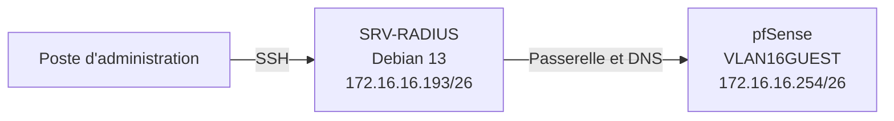

# Installation du serveur FreeRADIUS — Projet 3 Pharmgreen

## 1. Objectif du document

Ce document décrit l’installation du serveur **FreeRADIUS** utilisé dans le Projet 3 TSSR de l’entreprise fictive **Pharmgreen**.

Le serveur a été installé sur une machine virtuelle **Debian 13** hébergée sur **Proxmox**. Son rôle est de recevoir les demandes d’authentification envoyées par le pare-feu **pfSense**, puis de les transmettre à l’Active Directory du domaine `pharmgreen.lan`.

Ce fichier couvre uniquement :

- la création et la préparation de la machine virtuelle ;
- l’installation de Debian 13 ;
- la configuration réseau de base ;
- l’installation des paquets FreeRADIUS ;
- l’activation du service ;
- les premiers tests locaux ;
- les vérifications et erreurs courantes.

La configuration de l’intégration avec **pfSense**, **Active Directory**, **LDAP/StartTLS**, les groupes AD et la limitation de session est détaillée dans le fichier `configuration.md`.

> **Sécurité :** aucun mot de passe ni secret RADIUS réel ne doit être publié dans GitHub. Ils doivent être remplacés par des valeurs comme `<SECRET_PARTAGE>` ou `<MOT_DE_PASSE>`.

---

## 2. Architecture d’installation



À ce stade de l’installation, l’objectif est uniquement d’obtenir un serveur Debian joignable, à jour et disposant d’un service FreeRADIUS opérationnel.

---

## 3. Paramètres utilisés

| Élément | Valeur |
|---|---|
| Projet | Projet 3 TSSR — Pharmgreen |
| Hyperviseur | Proxmox |
| Nom de la VM | `SRV-RADIUS` |
| Système d’exploitation | Debian 13 |
| Carte réseau Proxmox | `vmbr316` |
| VLAN / réseau | `VLAN16GUEST` |
| Adresse IP | `172.16.16.193/26` |
| Masque | `255.255.255.192` |
| Passerelle | `172.16.16.254` |
| Serveur DNS | `172.16.16.254` |
| Domaine de recherche | `pharmgreen.lan` |
| Contrôleur de domaine | `172.16.6.1` |
| Service installé | FreeRADIUS |
| Port d’authentification | UDP `1812` |
| Port de comptabilisation | UDP `1813` |

---

## 4. Prérequis

Avant l’installation, les éléments suivants doivent être disponibles :

- un accès à l’interface web de Proxmox ;
- une image ISO de Debian 13 ;
- une adresse IP fixe réservée pour le serveur ;
- une passerelle joignable ;
- un accès à Internet ou aux dépôts Debian ;
- un compte disposant des droits `root` ou `sudo` ;
- un poste d’administration permettant une connexion SSH.

### Ressources attribuées à la VM

| Ressource | Valeur utilisée |
|---|---|
| Processeur | 1 à 2 vCPU |
| Mémoire vive | 2 Go |
| Disque | 20 Go |
| Carte réseau | VirtIO |
| Bridge Proxmox | `vmbr316` |

---

## 5. Création de la machine virtuelle dans Proxmox

Dans l’interface web Proxmox :

```text
Datacenter > Nœud Proxmox > Create VM
```

### Paramètres principaux

1. Donner le nom `SRV-RADIUS` à la machine virtuelle.
2. Sélectionner l’image ISO de Debian 13.
3. Créer un disque virtuel de 20 Go.
4. Attribuer 1 ou 2 processeurs virtuels.
5. Attribuer 2 Go de mémoire vive.
6. Ajouter une carte réseau de type `VirtIO`.
7. Relier la carte réseau au bridge `vmbr316`.
8. Vérifier le résumé, puis créer la VM.

> **Preuve à conserver :** capture du matériel virtuel de la VM dans Proxmox avec le nom, le disque, la RAM, les vCPU et le bridge réseau.

---

## 6. Installation de Debian 13

Démarrer la VM et lancer l’installation de Debian.

### Choix réalisés pendant l’installation

- langue : français ;
- clavier : français ;
- nom de machine : `SRV-RADIUS` ;
- domaine : `pharmgreen.lan` ;
- partitionnement : assisté sur le disque entier ;
- environnement graphique : non nécessaire ;
- serveur SSH : installé ;
- utilitaires usuels du système : installés.

### Sélection des logiciels

Lors de l’écran de sélection des logiciels, conserver au minimum :

```text
[ ] Environnement de bureau Debian
[x] Serveur SSH
[x] Utilitaires usuels du système
```

L’absence d’interface graphique réduit la consommation de ressources et correspond à l’administration habituelle d’un serveur Linux.

> **Preuve à conserver :** capture de la console Debian après la première connexion montrant le nom du serveur.

---

## 7. Configuration du nom d’hôte

Vérifier le nom de la machine :

```bash
hostnamectl
```

Si nécessaire, le définir avec :

```bash
sudo hostnamectl set-hostname SRV-RADIUS
```

Vérifier le fichier `/etc/hosts` :

```bash
sudo nano /etc/hosts
```

Exemple :

```text
127.0.0.1       localhost
127.0.1.1       SRV-RADIUS.pharmgreen.lan SRV-RADIUS
```

### Test

```bash
hostname
hostname -f
```

Résultats attendus :

```text
SRV-RADIUS
SRV-RADIUS.pharmgreen.lan
```

---

## 8. Configuration réseau statique

Le serveur FreeRADIUS doit conserver la même adresse IP afin que pfSense puisse toujours envoyer ses requêtes vers le bon serveur.

Éditer le fichier réseau :

```bash
sudo nano /etc/network/interfaces
```

Configuration utilisée :

```text
auto lo
iface lo inet loopback

auto ens18
iface ens18 inet static
    address 172.16.16.193/26
    gateway 172.16.16.254
    dns-nameservers 172.16.16.254
    dns-search pharmgreen.lan
```

> Le nom de l’interface peut être différent. Il doit être vérifié avec `ip -br a` avant de modifier le fichier.

Redémarrer le service réseau :

```bash
sudo systemctl restart networking
```

### Vérifications

```bash
ip -br a
ip route
cat /etc/resolv.conf
ping -c 4 172.16.16.254
getent hosts PG-00005-X00001.pharmgreen.lan
```

Résultats attendus :

- l’interface possède l’adresse `172.16.16.193/26` ;
- la route par défaut utilise `172.16.16.254` ;
- la passerelle répond au ping ;
- le contrôleur de domaine est résolu par son nom DNS.

> **Preuve à conserver :** résultat de `ip -br a`, `ip route` et du ping vers la passerelle.

---

## 9. Connexion SSH depuis le poste d’administration

Depuis PowerShell ou un terminal SSH :

```powershell
ssh <UTILISATEUR>@172.16.16.193
```

Exemple de syntaxe :

```powershell
ssh admin@172.16.16.193
```

Lors de la première connexion, accepter l’empreinte du serveur si elle correspond bien à la VM créée.

### Vérification après connexion

```bash
whoami
hostname
ip -br a
```

> **Preuve à conserver :** capture de la connexion SSH réussie depuis le poste d’administration.

---

## 10. Mise à jour du système

Mettre à jour la liste des paquets :

```bash
sudo apt update
```

Installer les mises à jour disponibles :

```bash
sudo apt upgrade -y
```

Installer quelques outils utiles :

```bash
sudo apt install -y nano curl wget dnsutils net-tools
```

Redémarrer le serveur si nécessaire :

```bash
sudo reboot
```

Après le redémarrage, se reconnecter en SSH puis vérifier :

```bash
uptime
apt list --upgradable
```

---

## 11. Installation de FreeRADIUS

Installer le serveur et les outils nécessaires :

```bash
sudo apt install -y \
  freeradius \
  freeradius-utils \
  freeradius-ldap \
  ldap-utils \
  ca-certificates
```

### Rôle des paquets

| Paquet | Utilité |
|---|---|
| `freeradius` | service principal RADIUS |
| `freeradius-utils` | outils de test comme `radtest` |
| `freeradius-ldap` | module de connexion à un annuaire LDAP |
| `ldap-utils` | outils de test LDAP comme `ldapsearch` |
| `ca-certificates` | gestion des certificats d’autorités de certification |

---

## 12. Activation du service

Activer FreeRADIUS au démarrage et le lancer immédiatement :

```bash
sudo systemctl enable --now freeradius
```

Vérifier son état :

```bash
sudo systemctl status freeradius --no-pager
```

Résultat attendu :

```text
Active: active (running)
```

Vérifier son activation automatique :

```bash
sudo systemctl is-enabled freeradius
```

Résultat attendu :

```text
enabled
```

---

## 13. Vérification des ports

FreeRADIUS utilise principalement :

- UDP `1812` pour l’authentification ;
- UDP `1813` pour la comptabilisation.

Vérifier les ports en écoute :

```bash
sudo ss -lunp | grep -E ':1812|:1813'
```

Résultat attendu : une ou plusieurs lignes associées au processus `freeradius`.

> **Preuve à conserver :** capture de l’état `active (running)` et des ports UDP 1812/1813.

---

## 14. Emplacement des fichiers importants

Les fichiers principaux se trouvent dans :

```text
/etc/freeradius/3.0/
```

| Chemin | Rôle |
|---|---|
| `/etc/freeradius/3.0/clients.conf` | déclaration des équipements autorisés à contacter FreeRADIUS |
| `/etc/freeradius/3.0/users` | comptes ou règles locales de test |
| `/etc/freeradius/3.0/mods-available/ldap` | configuration du module LDAP |
| `/etc/freeradius/3.0/sites-enabled/default` | traitement des requêtes RADIUS |
| `/var/log/freeradius/` | journaux de FreeRADIUS |

Afficher l’arborescence :

```bash
sudo ls -la /etc/freeradius/3.0/
```

---

## 15. Sauvegarde de la configuration initiale

Avant toute modification, réaliser une copie du dossier de configuration :

```bash
sudo cp -a \
  /etc/freeradius/3.0 \
  /etc/freeradius/3.0.sauvegarde-initiale
```

Vérifier la copie :

```bash
sudo ls -ld /etc/freeradius/3.0*
```

Cette sauvegarde permet de revenir à l’état initial en cas d’erreur de configuration.

---

## 16. Test de syntaxe initial

Contrôler la configuration avant de poursuivre :

```bash
sudo freeradius -XC
```

Résultat attendu :

```text
Configuration appears to be OK
```

Cette commande vérifie les fichiers sans lancer le serveur en mode normal.

En cas d’erreur, FreeRADIUS indique généralement :

- le fichier concerné ;
- le numéro de ligne ;
- la directive incorrecte.

---

## 17. Test local de FreeRADIUS

Un compte temporaire peut être ajouté pour vérifier le fonctionnement du serveur avant l’intégration à Active Directory.

Éditer :

```bash
sudo nano /etc/freeradius/3.0/users
```

Ajouter temporairement au début du fichier :

```text
tssrtest Cleartext-Password := "<MOT_DE_PASSE_TEST>"
```

Vérifier dans `clients.conf` le secret associé au client `localhost`, puis effectuer le test :

```bash
radtest \
  tssrtest \
  '<MOT_DE_PASSE_TEST>' \
  127.0.0.1 \
  0 \
  '<SECRET_LOCALHOST>'
```

Résultat attendu :

```text
Received Access-Accept
```

Un `Access-Accept` signifie que le serveur a accepté les identifiants présentés.

Après le test, supprimer ou commenter le compte temporaire :

```bash
sudo nano /etc/freeradius/3.0/users
```

Puis redémarrer le service :

```bash
sudo systemctl restart freeradius
```

> **Preuve à conserver :** capture du message `Received Access-Accept`.

---

## 18. Consultation des journaux

Afficher les derniers événements du service :

```bash
sudo journalctl -u freeradius --no-pager -n 50
```

Suivre les événements en temps réel :

```bash
sudo journalctl -u freeradius -f
```

Afficher les fichiers de journaux éventuels :

```bash
sudo find /var/log/freeradius -maxdepth 2 -type f -ls
```

---

## 19. Mode diagnostic

Pour lancer FreeRADIUS en mode diagnostic, il faut d’abord arrêter le service normal afin d’éviter que le port soit déjà utilisé :

```bash
sudo systemctl stop freeradius
sudo pgrep -a freeradius
sudo freeradius -X
```

Résultat attendu à la fin du démarrage :

```text
Ready to process requests
```

Pour quitter le mode diagnostic :

```text
Ctrl + C
```

Puis relancer le service normal :

```bash
sudo systemctl start freeradius
sudo systemctl status freeradius --no-pager
```

---

## 20. Erreurs possibles pendant l’installation

### 20.1 La commande `apt update` échoue

#### Vérifications

```bash
ip route
ping -c 4 172.16.16.254
getent hosts deb.debian.org
```

#### Causes possibles

- mauvaise adresse IP ;
- passerelle incorrecte ;
- DNS incorrect ;
- règle pfSense manquante ;
- interface réseau non reliée au bon bridge Proxmox.

---

### 20.2 Le service FreeRADIUS ne démarre pas

#### Diagnostic

```bash
sudo freeradius -XC
sudo systemctl status freeradius --no-pager
sudo journalctl -u freeradius --no-pager -n 50
```

#### Correction

Corriger le fichier et la ligne indiqués, puis tester de nouveau :

```bash
sudo freeradius -XC
sudo systemctl restart freeradius
```

---

### 20.3 Erreur `Address already in use`

Cette erreur signifie qu’une autre instance de FreeRADIUS utilise déjà les ports.

#### Correction

```bash
sudo systemctl stop freeradius
sudo pgrep -a freeradius
sudo freeradius -X
```

---

### 20.4 Aucun port 1812 ou 1813 n’apparaît

#### Vérifications

```bash
sudo systemctl status freeradius --no-pager
sudo freeradius -XC
sudo ss -lunp | grep -E ':1812|:1813'
```

Le service doit être démarré et sa configuration doit être valide.

---

### 20.5 `radtest` renvoie `Access-Reject`

Vérifier :

- le nom du compte temporaire ;
- le mot de passe ;
- le secret du client `localhost` ;
- la syntaxe du fichier `users` ;
- les messages affichés par `freeradius -X`.

---

## 21. Tests de validation de l’installation

| Test | Commande | Résultat attendu |
|---|---|---|
| Adresse IP | `ip -br a` | `172.16.16.193/26` |
| Route par défaut | `ip route` | via `172.16.16.254` |
| DNS interne | `getent hosts PG-00005-X00001.pharmgreen.lan` | adresse du contrôleur de domaine |
| État du service | `systemctl status freeradius` | `active (running)` |
| Démarrage automatique | `systemctl is-enabled freeradius` | `enabled` |
| Syntaxe | `freeradius -XC` | `Configuration appears to be OK` |
| Ports | `ss -lunp` | UDP 1812 et 1813 |
| Test local | `radtest` | `Received Access-Accept` |
| Mode diagnostic | `freeradius -X` | `Ready to process requests` |

---

## 22. État obtenu à la fin de l’installation

À la fin de cette procédure :

- la VM `SRV-RADIUS` fonctionne sous Debian 13 ;
- son adresse IP fixe est `172.16.16.193/26` ;
- sa passerelle et son DNS sont `172.16.16.254` ;
- elle est administrable en SSH ;
- le système est à jour ;
- FreeRADIUS et les modules LDAP sont installés ;
- le service démarre automatiquement ;
- les ports UDP 1812 et 1813 sont en écoute ;
- la syntaxe de la configuration est valide ;
- un test local peut retourner `Access-Accept`.

L’installation du serveur est donc terminée. La suite consiste à configurer :

1. pfSense comme client RADIUS ;
2. la liaison LDAP avec Active Directory ;
3. l’authentification des utilisateurs du domaine ;
4. la lecture des groupes Active Directory ;
5. la règle `Session-Timeout = 300` ;
6. le portail captif pfSense.

Ces étapes sont documentées dans `configuration.md`.

---

## 23. Points de sécurité

- ne jamais publier de mot de passe ou de secret RADIUS dans GitHub ;
- utiliser des placeholders dans la documentation ;
- sauvegarder les fichiers avant modification ;
- limiter l’accès SSH aux comptes autorisés ;
- vérifier régulièrement les mises à jour Debian ;
- consulter les journaux avant de redémarrer un service ;
- utiliser un compte de service dédié pour LDAP en production ;
- vérifier le certificat de l’autorité de certification lors de l’utilisation de StartTLS.

---

## 24. Correspondance avec le REAC TSSR

Cette installation mobilise principalement les compétences suivantes :

- **Exploiter des serveurs Linux** : installation des paquets, gestion des services, réseau, journaux et droits ;
- **Exploiter un réseau IP** : adresse statique, masque, passerelle, DNS et tests de connectivité ;
- **Maintenir des serveurs dans une infrastructure virtualisée** : création et exploitation d’une VM sous Proxmox ;
- **Maintenir et sécuriser les accès à Internet et les interconnexions des réseaux** : préparation d’un service d’authentification centralisé ;
- **Mettre en œuvre une démarche de résolution de problème** : vérification par étapes du réseau, du service, des ports et des journaux.

---

## 25. Conclusion

Le serveur FreeRADIUS a été installé sur une VM Debian 13 hébergée par Proxmox. Son fonctionnement de base a été validé grâce au contrôle du service, des ports UDP, de la syntaxe et d’un test d’authentification local.

Le serveur est prêt à être intégré à pfSense et à l’Active Directory du domaine `pharmgreen.lan`.
