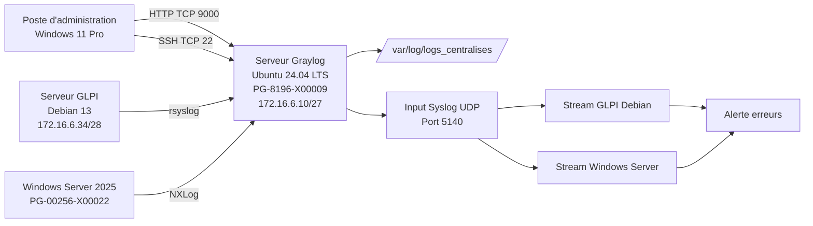

# Configuration du serveur de journalisation Graylog

## 1. Objectif

Ce document décrit la configuration réalisée après l’installation du serveur **Graylog** dans le cadre du **Projet 3 TSSR Pharmgreen**.

L’installation d’Ubuntu Server, de MongoDB, de Graylog Data Node et de Graylog Server est décrite dans le fichier `installation.md`.

Cette documentation couvre :

- la réception centralisée des journaux ;
- la création du dossier `/var/log/logs_centralises` ;
- la conservation d’une copie locale des journaux reçus ;
- la création d’un input Syslog dans Graylog ;
- l’envoi des journaux Linux avec `rsyslog` ;
- l’envoi des événements Windows avec `NXLog` ;
- la création de streams par machine ;
- la création d’une alerte sur les événements d’erreur ;
- les tests de validation ;
- les commandes de diagnostic ;
- l’incident de saturation du disque.

> **Sécurité :** aucun mot de passe, secret ou certificat privé ne doit être publié dans GitHub.

---

## 2. Pourquoi centraliser les journaux ?

Un journal, aussi appelé **log**, est un fichier ou un événement qui enregistre ce qui se passe sur un système.

Sans centralisation, il faut se connecter séparément sur chaque serveur pour chercher une erreur.

Avec Graylog, les événements de plusieurs machines arrivent dans une interface unique.

### Analogie

Graylog fonctionne comme un poste central de tri :

- les serveurs envoient leurs événements ;
- Graylog les reçoit ;
- les streams les rangent par machine ;
- les recherches permettent de retrouver une erreur ;
- les alertes signalent certains événements importants.

```text
Serveur Debian GLPI ── rsyslog ──┐
                                 │
                                 v
                         Serveur Graylog
                                 │
Windows Server 2025 ── NXLog ────┤
                                 │
                 ┌───────────────┴───────────────┐
                 v                               v
      /var/log/logs_centralises          Interface Graylog
       copie locale des logs         streams, recherches, alertes
```

---

## 3. Architecture utilisée



---

## 4. Paramètres principaux

| Élément | Valeur |
|---|---|
| Entreprise | Pharmgreen |
| Hyperviseur | Proxmox |
| Serveur Graylog | `PG-8196-X00009` |
| Système Graylog | Ubuntu Server 24.04 LTS |
| Adresse Graylog | `172.16.6.10/27` |
| Passerelle | `172.16.6.30` |
| VLAN | VLAN 12 — Journalisation |
| Interface web | `http://172.16.6.10:9000` |
| Input Graylog | Syslog UDP |
| Port de l’input Graylog | UDP `5140` |
| Port du relais rsyslog local | UDP `1514` |
| Dossier d’archive | `/var/log/logs_centralises` |
| Source Linux | serveur Debian hébergeant GLPI |
| Source Windows | Windows Server 2025 |
| Agent Linux | `rsyslog` |
| Agent Windows | `NXLog Community Edition` |
| Classement | un stream par machine |
| Alerte | événements contenant une erreur |

> Le nom d’hôte du serveur GLPI doit être vérifié avec `hostnamectl`. Le nom utilisé dans les règles de stream doit correspondre exactement au champ `source` visible dans Graylog.

---

## 5. Flux retenu

Afin d’obtenir à la fois une copie locale des journaux et une consultation dans Graylog, le serveur utilise deux ports différents :

```text
Sources
  |
  | Syslog UDP 1514
  v
rsyslog du serveur Graylog
  |
  +--> /var/log/logs_centralises/[machine]/[programme].log
  |
  +--> transfert local vers 127.0.0.1:5140
                              |
                              v
                    Input Syslog UDP Graylog
```

Le port `1514` est utilisé par `rsyslog`.

Le port `5140` est utilisé par Graylog.

Cette séparation évite que deux services essaient d’écouter sur le même port.

---

# Partie A — Création du dossier `logs_centralises`

## 6. Création du dossier

Créer le dossier racine :

```bash
sudo install -d \
  -o syslog \
  -g adm \
  -m 0750 \
  /var/log/logs_centralises
```

### Explication

| Élément | Rôle |
|---|---|
| `install -d` | crée le dossier |
| `-o syslog` | définit `syslog` comme propriétaire |
| `-g adm` | autorise le groupe d’administration des logs |
| `-m 0750` | donne les droits nécessaires sans rendre le dossier public |

Vérifier :

```bash
sudo ls -ld /var/log/logs_centralises
```

Résultat attendu :

```text
drwxr-x--- syslog adm ... /var/log/logs_centralises
```

---

## 7. Organisation attendue

Les sous-dossiers sont créés automatiquement selon la machine qui envoie le message.

Exemple :

```text
/var/log/logs_centralises/
├── PG-4096-X00001/
│   ├── apache2.log
│   ├── systemd.log
│   └── sudo.log
└── PG-00256-X00022/
    ├── Application.log
    ├── Security.log
    └── System.log
```

L’organisation réelle peut varier selon le nom du programme reçu dans le message Syslog.

Afficher l’arborescence :

```bash
sudo find /var/log/logs_centralises \
  -maxdepth 3 \
  -type f \
  -printf '%p\n'
```

---

# Partie B — Configuration de `rsyslog` sur le serveur Graylog

## 8. Pourquoi utiliser `rsyslog` sur le serveur Graylog ?

`rsyslog` reçoit les messages des machines distantes.

Il réalise deux actions :

1. il écrit une copie du message dans `/var/log/logs_centralises` ;
2. il transfère le même message vers l’input Graylog local sur UDP 5140.

---

## 9. Création du fichier de réception

Créer le fichier :

```bash
sudo nano /etc/rsyslog.d/20-logs-centralises.conf
```

Ajouter :

```text
module(load="imudp")

template(
    name="FichierParMachine"
    type="string"
    string="/var/log/logs_centralises/%HOSTNAME%/%PROGRAMNAME%.log"
)

ruleset(name="logs_distants") {

    action(
        type="omfile"
        dynaFile="FichierParMachine"
        createDirs="on"
        dirCreateMode="0750"
        fileCreateMode="0640"
    )

    action(
        type="omfwd"
        target="127.0.0.1"
        port="5140"
        protocol="udp"
        template="RSYSLOG_SyslogProtocol23Format"
    )

    stop
}

input(
    type="imudp"
    port="1514"
    ruleset="logs_distants"
)
```

### Rôle des éléments

| Élément | Rôle |
|---|---|
| `imudp` | reçoit des messages Syslog en UDP |
| `port="1514"` | port d’entrée du relais local |
| `FichierParMachine` | construit un chemin selon l’hôte et le programme |
| `omfile` | écrit les messages dans un fichier |
| `omfwd` | transfère les messages vers Graylog |
| `127.0.0.1:5140` | input Graylog présent sur la même VM |
| `stop` | évite de retraiter le même message dans les règles suivantes |

---

## 10. Test de syntaxe de `rsyslog`

Avant le redémarrage :

```bash
sudo rsyslogd -N1
```

Résultat attendu :

```text
rsyslogd: End of config validation run. Bye.
```

Redémarrer :

```bash
sudo systemctl restart rsyslog
```

Vérifier :

```bash
sudo systemctl status rsyslog --no-pager
```

Vérifier le port :

```bash
sudo ss -lunp | grep ':1514'
```

---

## 11. Test local du relais

Depuis le serveur Graylog :

```bash
logger \
  --server 127.0.0.1 \
  --udp \
  --port 1514 \
  --tag TEST_GRAYLOG \
  "Test du dossier logs_centralises"
```

Vérifier la création du fichier :

```bash
sudo find /var/log/logs_centralises \
  -type f \
  -mmin -5 \
  -ls
```

Lire les dernières lignes :

```bash
sudo grep -R \
  "Test du dossier logs_centralises" \
  /var/log/logs_centralises
```

---

# Partie C — Rotation des fichiers locaux

## 12. Pourquoi mettre en place une rotation ?

Sans rotation, les fichiers grossissent continuellement et peuvent remplir le disque.

La rotation permet :

- de créer régulièrement un nouveau fichier ;
- de compresser les anciens fichiers ;
- de supprimer les archives trop anciennes ;
- de limiter la consommation de stockage.

---

## 13. Configuration de `logrotate`

Créer :

```bash
sudo nano /etc/logrotate.d/logs-centralises
```

Ajouter :

```text
/var/log/logs_centralises/*/*.log {
    daily
    rotate 7
    compress
    delaycompress
    missingok
    notifempty
    copytruncate
    create 0640 syslog adm
}
```

### Explication

| Directive | Rôle |
|---|---|
| `daily` | rotation quotidienne |
| `rotate 7` | conservation de sept rotations |
| `compress` | compression des anciens fichiers |
| `missingok` | absence de fichier non bloquante |
| `notifempty` | ne tourne pas un fichier vide |
| `copytruncate` | copie puis vide le fichier actif |
| `create` | recrée le fichier avec les bons droits |

Tester sans effectuer la rotation :

```bash
sudo logrotate -d /etc/logrotate.d/logs-centralises
```

Forcer un test uniquement lorsque la configuration est validée :

```bash
sudo logrotate -f /etc/logrotate.d/logs-centralises
```

---

# Partie D — Création de l’input Graylog

## 14. Accès à l’interface

Depuis le poste d’administration :

```text
http://172.16.6.10:9000
```

Se connecter avec le compte administrateur Graylog.

---

## 15. Création de l’input Syslog UDP

Dans Graylog :

```text
System > Inputs
```

Sélectionner :

```text
Syslog UDP
```

Puis cliquer sur :

```text
Launch new input
```

Paramètres utilisés :

| Champ | Valeur |
|---|---|
| Title | `Syslog_UDP_Centralisation` |
| Global | activé |
| Bind address | `0.0.0.0` |
| Port | `5140` |
| Receive Buffer Size | valeur par défaut |
| Override source | vide |
| Timezone | `Europe/Paris` si le champ est disponible |

Enregistrer puis démarrer l’input.

### Vérification Linux

```bash
sudo ss -lunp | grep ':5140'
```

### Vérification Graylog

L’input doit apparaître avec l’état :

```text
RUNNING
```

---

## 16. Test de bout en bout

Depuis le serveur Graylog :

```bash
logger \
  --server 127.0.0.1 \
  --udp \
  --port 1514 \
  --tag TEST_GRAYLOG \
  "Test complet rsyslog vers Graylog"
```

Dans Graylog :

```text
Search
```

Rechercher :

```text
message:"Test complet rsyslog vers Graylog"
```

Résultat attendu :

- le message apparaît dans Graylog ;
- une copie est présente dans `/var/log/logs_centralises`.

---

# Partie E — Envoi des journaux du serveur Debian GLPI

## 17. Vérification du service `rsyslog`

Sur le serveur Debian GLPI :

```bash
sudo systemctl status rsyslog --no-pager
```

S’il n’est pas installé :

```bash
sudo apt update
sudo apt install -y rsyslog
sudo systemctl enable --now rsyslog
```

---

## 18. Configuration de l’envoi

Créer :

```bash
sudo nano /etc/rsyslog.d/90-graylog.conf
```

Ajouter :

```text
*.* action(
    type="omfwd"
    target="172.16.6.10"
    port="1514"
    protocol="udp"
    template="RSYSLOG_SyslogProtocol23Format"
)
```

Tester la syntaxe :

```bash
sudo rsyslogd -N1
```

Redémarrer :

```bash
sudo systemctl restart rsyslog
```

Vérifier :

```bash
sudo systemctl status rsyslog --no-pager
sudo journalctl -u rsyslog -n 50 --no-pager
```

---

## 19. Test depuis le serveur GLPI

Afficher le nom envoyé comme source :

```bash
hostnamectl
hostname
```

Envoyer un message :

```bash
logger \
  -p user.notice \
  -t GLPI_TEST \
  "Test rsyslog depuis le serveur GLPI"
```

Dans Graylog, rechercher :

```text
message:"Test rsyslog depuis le serveur GLPI"
```

Sur le serveur Graylog :

```bash
sudo grep -R \
  "Test rsyslog depuis le serveur GLPI" \
  /var/log/logs_centralises
```

Résultat attendu : le même message est visible dans Graylog et dans le dossier d’archive.

---

## 20. Journaux Apache utiles

Les événements système sont envoyés automatiquement par `rsyslog`.

Pour envoyer également des fichiers Apache précis, il est possible d’ajouter sur le serveur GLPI :

```bash
sudo nano /etc/rsyslog.d/91-apache-graylog.conf
```

Exemple :

```text
module(load="imfile")

input(
    type="imfile"
    File="/var/log/apache2/glpi_access.log"
    Tag="apache_glpi_access"
    Severity="info"
    Facility="local6"
)

input(
    type="imfile"
    File="/var/log/apache2/glpi_error.log"
    Tag="apache_glpi_error"
    Severity="error"
    Facility="local6"
)
```

Le fichier `90-graylog.conf` transfère ensuite ces événements vers Graylog.

Après modification :

```bash
sudo rsyslogd -N1
sudo systemctl restart rsyslog
```

> Cette partie doit uniquement être conservée comme « réalisée » si les fichiers `glpi_access.log` et `glpi_error.log` existent réellement sur le serveur.

---

# Partie F — Envoi des événements Windows avec NXLog

## 21. Installation de NXLog

NXLog Community Edition a été utilisé sur Windows Server 2025.

Après l’installation, le fichier principal est :

```text
C:\Program Files\nxlog\conf\nxlog.conf
```

Sauvegarder le fichier d’origine depuis PowerShell administrateur :

```powershell
Copy-Item `
  "C:\Program Files\nxlog\conf\nxlog.conf" `
  "C:\Program Files\nxlog\conf\nxlog.conf.original"
```

---

## 22. Configuration de NXLog

Ouvrir le fichier avec un éditeur lancé en administrateur.

Configuration utilisée :

```text
define ROOT C:\Program Files\nxlog

Moduledir %ROOT%\modules
CacheDir  %ROOT%\data
Pidfile   %ROOT%\data\nxlog.pid
SpoolDir  %ROOT%\data
LogFile   %ROOT%\data\nxlog.log

<Extension syslog>
    Module xm_syslog
</Extension>

<Input windows_events>
    Module im_msvistalog

    <QueryXML>
        <QueryList>
            <Query Id="0">
                <Select Path="Application">*</Select>
                <Select Path="Security">*</Select>
                <Select Path="System">*</Select>
            </Query>
        </QueryList>
    </QueryXML>

    Exec $Message = replace($Message, "\r\n", " ");
    Exec to_syslog_bsd();
</Input>

<Output graylog>
    Module om_udp
    Host   172.16.6.10
    Port   1514
</Output>

<Route windows_to_graylog>
    Path windows_events => graylog
</Route>
```

### Événements collectés

- journal `Application` ;
- journal `Security` ;
- journal `System`.

---

## 23. Redémarrage et contrôle de NXLog

Depuis PowerShell administrateur :

```powershell
Restart-Service nxlog
Get-Service nxlog
```

Résultat attendu :

```text
Status : Running
```

Lire le journal NXLog :

```powershell
Get-Content `
  "C:\Program Files\nxlog\data\nxlog.log" `
  -Tail 50
```

Tester le port depuis Windows :

```powershell
Test-NetConnection `
  172.16.6.10 `
  -Port 1514 `
  -InformationLevel Detailed
```

> `Test-NetConnection` teste principalement TCP. Pour UDP, la validation réelle consiste à générer un événement puis à vérifier sa réception dans Graylog.

---

## 24. Génération d’un événement Windows de test

Créer un événement dans le journal Application :

```powershell
eventcreate `
  /T ERROR `
  /ID 100 `
  /L APPLICATION `
  /SO "TEST-GRAYLOG" `
  /D "Test NXLog vers Graylog"
```

Dans Graylog, rechercher :

```text
message:"Test NXLog vers Graylog"
```

Sur le serveur Graylog :

```bash
sudo grep -R \
  "Test NXLog vers Graylog" \
  /var/log/logs_centralises
```

---

# Partie G — Création des streams

## 25. Pourquoi utiliser des streams ?

Un **stream** est un classement automatique des messages selon des règles.

Les streams permettent de séparer :

- les journaux du serveur Debian GLPI ;
- les journaux du serveur Windows ;
- les autres messages reçus.

---

## 26. Identifier la valeur exacte du champ `source`

Avant de créer une règle :

1. ouvrir un message reçu ;
2. repérer le champ `source` ;
3. copier exactement sa valeur.

Exemples possibles :

```text
PG-4096-X00001
PG-00256-X00022
```

La valeur dépend du nom d’hôte réellement envoyé.

---

## 27. Stream du serveur GLPI

Dans Graylog :

```text
Streams > Create stream
```

Paramètres :

| Champ | Valeur |
|---|---|
| Title | `Logs_GLPI_Debian` |
| Description | `Journaux du serveur Debian hébergeant GLPI` |
| Index Set | `Default index set` |
| Remove matches from All messages | non |

Créer ensuite la règle :

| Champ | Valeur |
|---|---|
| Field | `source` |
| Type | `match exactly` |
| Value | `<SOURCE_EXACTE_DU_SERVEUR_GLPI>` |

Enregistrer puis cliquer sur :

```text
Start stream
```

---

## 28. Stream du serveur Windows

Créer un second stream :

| Champ | Valeur |
|---|---|
| Title | `Logs_Windows_Server` |
| Description | `Événements transmis par NXLog` |
| Index Set | `Default index set` |
| Remove matches from All messages | non |

Règle :

| Champ | Valeur |
|---|---|
| Field | `source` |
| Type | `match exactly` |
| Value | `PG-00256-X00022` |

Enregistrer puis démarrer le stream.

---

## 29. Vérification des streams

Envoyer un message de test depuis chaque source.

Dans chaque stream, vérifier :

- que les messages attendus apparaissent ;
- que les messages de l’autre machine n’apparaissent pas ;
- que le champ `source` est correct ;
- que la date et l’heure sont cohérentes.

---

# Partie H — Création de l’alerte

## 30. Objectif de l’alerte

L’alerte doit signaler la présence d’un événement pouvant correspondre à une erreur.

Dans le projet, l’alerte servait à :

- identifier la machine concernée ;
- repérer le service ou le programme ;
- relever l’heure de l’événement ;
- ouvrir les messages associés ;
- commencer une démarche de diagnostic.

---

## 31. Création de l’Event Definition

Dans Graylog :

```text
Alerts > Event Definitions > Create Event Definition
```

### Informations générales

| Champ | Valeur |
|---|---|
| Title | `Alerte_Erreurs_Serveurs` |
| Description | `Détection des erreurs reçues depuis les serveurs` |
| Priority | `Normal` ou `High` selon le test |

### Condition

Sélectionner une condition de type filtre et agrégation.

Streams :

```text
Logs_GLPI_Debian
Logs_Windows_Server
```

Exemple de requête :

```text
level:[0 TO 3] OR message:(error OR failed OR failure OR critical)
```

Paramètres de laboratoire :

| Champ | Valeur |
|---|---|
| Search within the last | 5 minutes |
| Execute search every | 1 minute |
| Condition | count() > 0 |

Ajouter comme champs utiles, lorsque disponibles :

```text
source
message
timestamp
```

Enregistrer puis activer l’Event Definition.

---

## 32. Notification

L’apparition de l’événement dans Graylog a été validée.

Aucune preuve suffisante n’a été conservée concernant une notification par courriel ou messagerie externe.

Il ne faut donc pas présenter l’envoi d’un courriel comme réalisé tant qu’un canal de notification n’a pas été configuré et testé.

---

## 33. Test de l’alerte depuis Linux

Sur le serveur GLPI :

```bash
logger \
  -p user.err \
  -t GLPI_ERROR_TEST \
  "error test Graylog depuis GLPI"
```

Dans Graylog :

```text
Alerts > Events
```

Vérifier :

- la création d’un événement ;
- le nom de la machine ;
- le message ;
- l’heure ;
- le lien vers les messages associés.

---

## 34. Test de l’alerte depuis Windows

Depuis PowerShell administrateur :

```powershell
eventcreate `
  /T ERROR `
  /ID 101 `
  /L APPLICATION `
  /SO "TEST-GRAYLOG" `
  /D "error test Graylog depuis Windows"
```

Vérifier ensuite l’événement dans Graylog.

---

# Partie I — Recherches utiles

## 35. Rechercher par machine

```text
source:"PG-00256-X00022"
```

ou :

```text
source:"<SOURCE_SERVEUR_GLPI>"
```

---

## 36. Rechercher les erreurs

```text
message:(error OR failed OR critical)
```

Pour les niveaux Syslog critiques :

```text
level:[0 TO 3]
```

---

## 37. Rechercher une période

Utiliser le sélecteur de temps en haut de l’interface :

```text
Last 5 minutes
Last 30 minutes
Last 1 hour
Absolute
```

Le mode `Absolute` permet de choisir précisément une date et une heure de début et de fin.

---

# Partie J — Contrôles du serveur Graylog

## 38. État des services

```bash
sudo systemctl status mongod --no-pager
sudo systemctl status graylog-datanode --no-pager
sudo systemctl status graylog-server --no-pager
sudo systemctl status rsyslog --no-pager
```

---

## 39. Ports en écoute

```bash
sudo ss -lntup | \
grep -E ':9000|:8999|:9200|:27017|:5140|:1514'
```

Résultats attendus :

| Port | Service |
|---|---|
| TCP `9000` | interface Graylog |
| TCP `8999` | Graylog Data Node |
| TCP `9200` | OpenSearch local |
| TCP `27017` | MongoDB |
| UDP `5140` | input Graylog |
| UDP `1514` | relais rsyslog |

---

## 40. Journaux des services

```bash
sudo journalctl -u graylog-server -n 100 --no-pager
sudo journalctl -u graylog-datanode -n 100 --no-pager
sudo journalctl -u mongod -n 100 --no-pager
sudo journalctl -u rsyslog -n 100 --no-pager
```

Fichier Graylog :

```bash
sudo tail -n 100 \
  /var/log/graylog-server/server.log
```

---

## 41. Consultation des archives locales

Afficher les fichiers les plus récents :

```bash
sudo find /var/log/logs_centralises \
  -type f \
  -printf '%TY-%Tm-%Td %TH:%TM %p\n' | \
sort -r | \
head -20
```

Lire un fichier en temps réel :

```bash
sudo tail -f \
  /var/log/logs_centralises/<MACHINE>/<PROGRAMME>.log
```

Rechercher une erreur :

```bash
sudo grep -RniE \
  'error|failed|critical' \
  /var/log/logs_centralises
```

---

# Partie K — Incident de saturation du disque

## 42. Symptôme rencontré

La VM Graylog ne démarrait plus correctement.

La partition racine `/` avait atteint `100 %` d’occupation.

Graylog stocke beaucoup de données. Lorsque le disque est plein :

- MongoDB peut ne plus écrire ;
- OpenSearch peut se bloquer ;
- Graylog peut ne plus démarrer ;
- les inputs peuvent ne plus recevoir de messages ;
- les journaux locaux peuvent ne plus être créés.

---

## 43. Diagnostic

```bash
df -h
```

Rechercher les dossiers volumineux :

```bash
sudo du -xhd1 / | sort -h
sudo du -xhd1 /var | sort -h
sudo du -xhd1 /var/lib | sort -h
sudo du -xhd1 /var/log | sort -h
```

Vérifier les données Graylog :

```bash
sudo du -sh /var/lib/graylog* 2>/dev/null
sudo du -sh /var/lib/mongodb 2>/dev/null
sudo du -sh /var/log/logs_centralises 2>/dev/null
```

Vérifier les journaux systemd :

```bash
journalctl --disk-usage
```

---

## 44. Nettoyage prudent

Nettoyer les paquets devenus inutiles :

```bash
sudo apt clean
sudo apt autoremove --purge -y
```

Limiter les anciens journaux systemd :

```bash
sudo journalctl --vacuum-time=7d
```

Tester la rotation :

```bash
sudo logrotate -d /etc/logrotate.d/logs-centralises
```

> Ne jamais supprimer directement les fichiers de MongoDB, du Data Node ou d’OpenSearch sans procédure de sauvegarde et de restauration.

---

## 45. Vérification après correction

```bash
df -h
free -h
```

Redémarrer les services dans l’ordre :

```bash
sudo systemctl restart mongod
sudo systemctl restart graylog-datanode
sudo systemctl restart graylog-server
sudo systemctl restart rsyslog
```

Contrôler :

```bash
sudo systemctl --no-pager --full status \
  mongod \
  graylog-datanode \
  graylog-server \
  rsyslog
```

Réaliser un nouveau test d’envoi depuis Linux et Windows.

---

# Partie L — Erreurs possibles et corrections

## 46. Aucun message n’arrive dans Graylog

### Contrôles

```bash
sudo ss -lunp | grep -E ':1514|:5140'
sudo systemctl status rsyslog --no-pager
sudo systemctl status graylog-server --no-pager
sudo journalctl -u rsyslog -n 50 --no-pager
```

Vérifier également :

- l’adresse IP `172.16.6.10` ;
- les règles pfSense ;
- le port utilisé par les sources ;
- l’état de l’input Graylog ;
- la présence d’un message dans `/var/log/logs_centralises`.

---

## 47. Les fichiers ne sont pas créés

Vérifier les droits :

```bash
sudo ls -ld /var/log/logs_centralises
sudo namei -l /var/log/logs_centralises
```

Réappliquer :

```bash
sudo chown syslog:adm /var/log/logs_centralises
sudo chmod 0750 /var/log/logs_centralises
```

Tester la syntaxe :

```bash
sudo rsyslogd -N1
```

---

## 48. Le message est archivé mais absent de Graylog

Cela signifie que `rsyslog` reçoit correctement le message, mais que le transfert local ou l’input Graylog ne fonctionne pas.

Vérifier :

```bash
sudo ss -lunp | grep ':5140'
sudo journalctl -u rsyslog -n 100 --no-pager
sudo journalctl -u graylog-server -n 100 --no-pager
```

Vérifier dans l’interface que l’input est en état `RUNNING`.

---

## 49. Le stream reste vide

Causes possibles :

- valeur du champ `source` incorrecte ;
- règle non enregistrée ;
- stream non démarré ;
- messages plus anciens que la période de recherche.

Correction :

1. ouvrir un message reçu ;
2. copier la valeur exacte du champ `source` ;
3. modifier la règle ;
4. démarrer le stream ;
5. envoyer un nouveau message de test.

---

## 50. NXLog ne démarre pas

Depuis PowerShell administrateur :

```powershell
Get-Service nxlog
Get-Content `
  "C:\Program Files\nxlog\data\nxlog.log" `
  -Tail 100
```

Vérifier :

- la syntaxe de `nxlog.conf` ;
- le chemin du fichier ;
- les balises `<Input>`, `<Output>` et `<Route>` ;
- l’adresse du serveur Graylog ;
- le port `1514`.

---

## 51. Mauvaise heure dans Graylog

Vérifier l’heure des machines :

### Linux

```bash
timedatectl
```

### Windows

```powershell
Get-Date
w32tm /query /status
```

Vérifier aussi la plage temporelle sélectionnée dans Graylog.

---

# Partie M — Sauvegarde et sécurité

## 52. Sauvegarde de la configuration

```bash
sudo tar -czf \
  /root/graylog-configuration-$(date +%F).tar.gz \
  /etc/graylog \
  /etc/rsyslog.d \
  /etc/logrotate.d/logs-centralises
```

Ne pas publier cette archive sur GitHub si elle contient des secrets.

---

## 53. Éléments pouvant être publiés dans GitHub

Peuvent être publiés après vérification :

```text
installation.md
configuration.md
exemples/
├── 20-logs-centralises.conf.example
├── 90-graylog.conf.example
├── nxlog.conf.example
└── logs-centralises.logrotate.example
```

Ne pas publier :

- mots de passe ;
- `password_secret` ;
- `root_password_sha2` ;
- certificats privés ;
- sauvegardes MongoDB ;
- données réelles des utilisateurs ;
- journaux contenant des informations personnelles.

---

## 54. Règles réseau minimales

Les flux nécessaires sont :

| Source | Destination | Port | Rôle |
|---|---|---:|---|
| Poste d’administration | Graylog | TCP 22 | SSH |
| Poste d’administration | Graylog | TCP 9000 | interface web |
| Serveur GLPI | Graylog | UDP 1514 | journaux Linux |
| Windows Server | Graylog | UDP 1514 | événements NXLog |

MongoDB, OpenSearch et le Data Node restent internes au serveur Graylog dans le laboratoire.

---

# Partie N — Preuves à conserver


# Partie O — État final

## 56. Éléments réalisés et validés

- Graylog est accessible depuis le poste d’administration ;
- un input Syslog a été créé ;
- le serveur Debian GLPI transmet ses journaux avec `rsyslog` ;
- Windows Server 2025 transmet ses événements avec NXLog ;
- les messages sont consultables dans Graylog ;
- les journaux sont séparés par machine grâce aux streams ;
- une alerte sur des événements d’erreur a été mise en place ;
- le dossier `/var/log/logs_centralises` permet une consultation locale ;
- les services et les ports peuvent être vérifiés en ligne de commande ;
- un problème de saturation du disque a été diagnostiqué.

---


## 59. Conclusion

Le serveur Graylog centralise les journaux du serveur Debian GLPI et les événements du serveur Windows 2025.

Les messages reçus sont :

- archivés localement dans `/var/log/logs_centralises` ;
- transférés vers l’input Syslog de Graylog ;
- classés dans des streams selon leur machine d’origine ;
- recherchables depuis l’interface web ;
- analysés par une règle d’alerte en cas d’erreur.

Cette organisation facilite la surveillance quotidienne et permet d’appliquer une démarche de diagnostic structurée lorsqu’un service rencontre un dysfonctionnement.
