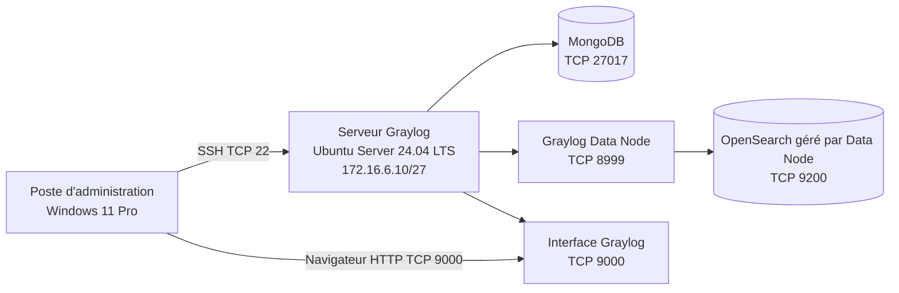

# Installation du serveur de journalisation Graylog

## 1. Objectif du document

Ce document décrit l’installation du serveur de centralisation des journaux **Graylog** réalisé dans le cadre du **Projet 3 TSSR Pharmgreen**.

Le serveur est installé sur une machine virtuelle **Ubuntu Server 24.04 LTS** hébergée sur **Proxmox**.

L’objectif est d’obtenir une plateforme capable de :

- recevoir les journaux provenant des serveurs et équipements ;
- centraliser les événements dans une interface unique ;
- rechercher et filtrer les messages ;
- conserver les journaux pour faciliter le diagnostic ;
- préparer la création d’inputs, de streams et d’alertes.

Ce fichier couvre uniquement l’installation du système et des composants nécessaires à Graylog.

La configuration des éléments suivants sera présentée dans `configuration.md` :

- création des inputs Syslog ;
- configuration du port `5140/UDP` ;
- envoi des journaux avec `rsyslog` ou `NXLog` ;
- création des streams ;
- règles de routage ;
- politique de rétention ;
- tableaux de bord ;
- alertes ;
- tests d’envoi depuis les autres serveurs.

> **Sécurité :** aucun mot de passe, secret ou condensat réel ne doit être publié dans GitHub. Les valeurs sensibles sont remplacées par des éléments comme `<PASSWORD_SECRET>` et `<HASH_MOT_DE_PASSE_ADMIN>`.

---

## 2. Pourquoi utiliser plusieurs composants ?

Graylog ne fonctionne pas seul. Il s’appuie sur plusieurs services qui ont chacun un rôle précis.

### Analogie simple

Graylog peut être comparé à un centre d’archives :

- **Graylog Server** est l’agent d’accueil qui reçoit et traite les messages ;
- **MongoDB** est le classeur qui conserve la configuration de Graylog ;
- **Graylog Data Node** est le magasinier qui organise le stockage et les recherches ;
- **OpenSearch**, géré par le Data Node, est l’entrepôt dans lequel les journaux sont indexés.

```text
Machines sources
      |
      | Journaux
      v
Graylog Server
      |
      +----> MongoDB
      |      Configuration et métadonnées
      |
      +----> Graylog Data Node
                    |
                    v
                OpenSearch
             Stockage et recherche
```

---

## 3. Architecture installée



Dans le laboratoire, les trois composants sont installés sur la même machine virtuelle.

---

## 4. Paramètres utilisés

| Élément | Valeur |
|---|---|
| Entreprise | Pharmgreen |
| Projet | Projet 3 TSSR |
| Hyperviseur | Proxmox |
| Système d’exploitation | Ubuntu Server 24.04 LTS |
| Nom d’hôte | `PG-8196-X00009` |
| Adresse IPv4 | `172.16.6.10/27` |
| Masque | `255.255.255.224` |
| Passerelle | `172.16.6.30` |
| VLAN | VLAN 12 — Journalisation |
| Interface réseau | `ens18` |
| Mémoire vive | 4 Go |
| Disque virtuel | 20 Go |
| Base de métadonnées | MongoDB |
| Moteur de recherche | OpenSearch géré par Graylog Data Node |
| Interface web Graylog | TCP `9000` |
| API du Data Node | TCP `8999` |
| MongoDB | TCP `27017` |
| OpenSearch local | TCP `9200` |
| Input Syslog prévu | UDP `5140` |

> L’adresse du serveur DNS doit être vérifiée sur la VM avec `resolvectl status` ou `cat /etc/resolv.conf` avant de publier une valeur définitive dans ce document.

---

## 5. Prérequis

Avant l’installation, les éléments suivants doivent être disponibles :

- accès à l’interface d’administration Proxmox ;
- image ISO d’Ubuntu Server 24.04 LTS ;
- accès Internet pour télécharger les paquets ;
- adresse IP fixe réservée ;
- accès à la passerelle du VLAN 12 ;
- compte Linux disposant de droits `sudo` ;
- poste d’administration permettant une connexion SSH ;
- au minimum 4 Go de RAM et 20 Go de disque pour le laboratoire.

### Ports utiles

| Port | Protocole | Rôle |
|---|---|---|
| `22` | TCP | administration SSH |
| `9000` | TCP | interface web et API Graylog |
| `8999` | TCP | API Graylog Data Node |
| `27017` | TCP | MongoDB |
| `9200` | TCP | OpenSearch local |
| `5140` | UDP | réception Syslog créée ultérieurement |

Les ports internes `27017`, `8999` et `9200` ne doivent pas être exposés inutilement à l’ensemble du réseau.

---

# Partie A — Préparation de la machine virtuelle

## 6. Création de la VM dans Proxmox

Dans l’interface web Proxmox :

```text
Datacenter > Nœud Proxmox > Create VM
```

Paramètres utilisés :

1. donner le nom `PG-8196-X00009` à la VM ;
2. sélectionner l’ISO Ubuntu Server 24.04 LTS ;
3. créer un disque virtuel de 20 Go ;
4. attribuer 4 Go de mémoire vive ;
5. ajouter une carte réseau de type VirtIO ;
6. connecter la carte au réseau correspondant au VLAN 12 ;
7. vérifier le résumé ;
8. créer puis démarrer la VM.

> **Preuve à conserver :** capture du matériel virtuel dans Proxmox avec le nom de la VM, la RAM, le disque et la carte réseau.

---

## 7. Installation d’Ubuntu Server 24.04 LTS

Pendant l’installation :

- choisir la langue et le clavier ;
- configurer le nom de machine `PG-8196-X00009` ;
- sélectionner le disque de 20 Go ;
- créer le compte d’administration ;
- installer **OpenSSH Server** ;
- terminer l’installation ;
- redémarrer la VM ;
- retirer l’image ISO si nécessaire.

Vérifier la version du système :

```bash
cat /etc/os-release
```

Résultat attendu :

```text
PRETTY_NAME="Ubuntu 24.04 LTS"
```

Vérifier le nom d’hôte :

```bash
hostnamectl
```

---

## 8. Configuration du nom d’hôte

Si nécessaire :

```bash
sudo hostnamectl set-hostname PG-8196-X00009
```

Vérifier le fichier `/etc/hosts` :

```bash
sudo nano /etc/hosts
```

Exemple :

```text
127.0.0.1       localhost
127.0.1.1       PG-8196-X00009
```

Contrôler :

```bash
hostname
hostnamectl
```

---

## 9. Configuration réseau statique

La carte utilisée est `ens18`.

Vérifier le nom de l’interface :

```bash
ip -br a
```

Dans le laboratoire, la configuration réseau a été renseignée dans :

```bash
sudo nano /etc/network/interfaces
```

Configuration utilisée :

```text
auto lo
iface lo inet loopback

auto ens18
iface ens18 inet static
    address 172.16.6.10/27
    gateway 172.16.6.30
    dns-nameservers <IP_DNS_PHARMGREEN>
```

Redémarrer le réseau ou la VM :

```bash
sudo systemctl restart networking
```

En cas de perte de la connexion SSH :

```bash
sudo reboot
```

### Vérifications

```bash
ip -br a
ip route
ping -c 4 172.16.6.30
resolvectl status
```

Résultats attendus :

- l’interface `ens18` possède `172.16.6.10/27` ;
- la route par défaut utilise `172.16.6.30` ;
- la passerelle répond au ping ;
- la résolution DNS fonctionne.

> **Preuve à conserver :** résultats de `ip -br a`, `ip route` et du ping vers la passerelle.

---

## 10. Connexion SSH depuis le poste d’administration

Depuis PowerShell ou un terminal :

```powershell
ssh <UTILISATEUR>@172.16.6.10
```

Après la connexion :

```bash
whoami
hostname
ip -br a
```

> **Preuve à conserver :** capture de la connexion SSH réussie depuis le poste Windows 11 Pro.

---

## 11. Mise à jour du système

Mettre à jour la liste des paquets :

```bash
sudo apt update
```

Installer les mises à jour :

```bash
sudo apt upgrade -y
```

Installer les outils nécessaires :

```bash
sudo apt install -y \
  curl \
  wget \
  gnupg \
  ca-certificates \
  openssl \
  net-tools \
  nano
```

Vérifier l’espace disque avant de poursuivre :

```bash
df -h
```

Vérifier la mémoire :

```bash
free -h
```

---

# Partie B — Installation de MongoDB

## 12. Ajout de la clé MongoDB

Télécharger et enregistrer la clé du dépôt MongoDB :

```bash
curl -fsSL https://www.mongodb.org/static/pgp/server-8.0.asc | \
sudo gpg -o /usr/share/keyrings/mongodb-server-8.0.gpg \
--dearmor
```

---

## 13. Ajout du dépôt MongoDB pour Ubuntu 24.04

Créer le fichier de dépôt :

```bash
echo "deb [ arch=amd64,arm64 signed-by=/usr/share/keyrings/mongodb-server-8.0.gpg ] https://repo.mongodb.org/apt/ubuntu noble/mongodb-org/8.0 multiverse" | \
sudo tee /etc/apt/sources.list.d/mongodb-org-8.0.list
```

Mettre à jour la liste des paquets :

```bash
sudo apt update
```

---

## 14. Installation et démarrage de MongoDB

Installer MongoDB :

```bash
sudo apt install -y mongodb-org
```

Activer et démarrer le service :

```bash
sudo systemctl daemon-reload
sudo systemctl enable --now mongod
```

Vérifier son état :

```bash
sudo systemctl status mongod --no-pager
```

Résultat attendu :

```text
Active: active (running)
```

Vérifier le port :

```bash
sudo ss -lntup | grep 27017
```

Pour éviter une mise à niveau automatique vers une version incompatible :

```bash
sudo apt-mark hold mongodb-org
```

---

# Partie C — Installation de Graylog Data Node et Graylog Server

## 15. Ajout du dépôt Graylog

Télécharger le paquet du dépôt Graylog utilisé lors du projet :

```bash
wget https://packages.graylog2.org/repo/packages/graylog-7.1-repository_latest.deb
```

Installer le dépôt :

```bash
sudo dpkg -i graylog-7.1-repository_latest.deb
```

Mettre à jour la liste des paquets :

```bash
sudo apt update
```

---

## 16. Installation des paquets Graylog

Installer le Data Node et le serveur Graylog :

```bash
sudo apt install -y \
  graylog-datanode \
  graylog-server
```

Bloquer les versions installées pour éviter une mise à niveau automatique non contrôlée :

```bash
sudo apt-mark hold graylog-datanode graylog-server
```

Vérifier les paquets :

```bash
dpkg -l | grep -E 'graylog|mongodb'
```

---

## 17. Paramètre Linux nécessaire au Data Node

OpenSearch a besoin d’un nombre suffisant de zones mémoire virtuelles.

Vérifier la valeur actuelle :

```bash
cat /proc/sys/vm/max_map_count
```

Définir la valeur requise :

```bash
echo 'vm.max_map_count=262144' | \
sudo tee /etc/sysctl.d/99-graylog-datanode.conf
```

Appliquer les paramètres :

```bash
sudo sysctl --system
```

Contrôler :

```bash
cat /proc/sys/vm/max_map_count
```

Résultat attendu :

```text
262144
```

---

# Partie D — Configuration minimale nécessaire au démarrage

## 18. Génération du `password_secret`

Le `password_secret` protège les informations sensibles enregistrées par Graylog.

Générer une valeur aléatoire :

```bash
openssl rand -hex 32
```

Exemple de résultat masqué :

```text
<PASSWORD_SECRET>
```

La même valeur doit être utilisée dans :

```text
/etc/graylog/datanode/datanode.conf
/etc/graylog/server/server.conf
```

> Ne jamais enregistrer cette valeur dans le dépôt GitHub.

---

## 19. Configuration minimale du Data Node

Sauvegarder le fichier d’origine :

```bash
sudo cp \
  /etc/graylog/datanode/datanode.conf \
  /etc/graylog/datanode/datanode.conf.bak
```

Ouvrir le fichier :

```bash
sudo nano /etc/graylog/datanode/datanode.conf
```

Renseigner au minimum :

```text
password_secret = <PASSWORD_SECRET>
mongodb_uri = mongodb://127.0.0.1:27017/graylog
opensearch_heap = 1g
```

### Explication

| Paramètre | Rôle |
|---|---|
| `password_secret` | secret commun entre Graylog Server et Data Node |
| `mongodb_uri` | connexion à MongoDB sur la même VM |
| `opensearch_heap` | mémoire Java attribuée à OpenSearch |

La valeur `1g` a été retenue en raison de la limite de 4 Go de RAM de la VM de laboratoire.

---

## 20. Génération du mot de passe administrateur

Choisir un mot de passe administrateur robuste, puis générer son condensat SHA-256 :

```bash
echo -n "Enter Password: " && \
head -1 </dev/stdin | \
tr -d '\n' | \
sha256sum | \
cut -d" " -f1
```

La commande retourne une valeur de ce type :

```text
<HASH_MOT_DE_PASSE_ADMIN>
```

Le mot de passe en clair doit être conservé dans un gestionnaire sécurisé.

Le hash seul sera placé dans `server.conf`.

---

## 21. Configuration minimale de Graylog Server

Sauvegarder le fichier :

```bash
sudo cp \
  /etc/graylog/server/server.conf \
  /etc/graylog/server/server.conf.bak
```

Ouvrir :

```bash
sudo nano /etc/graylog/server/server.conf
```

Renseigner ou décommenter les paramètres suivants :

```text
password_secret = <PASSWORD_SECRET>
root_password_sha2 = <HASH_MOT_DE_PASSE_ADMIN>

mongodb_uri = mongodb://127.0.0.1:27017/graylog

http_bind_address = 0.0.0.0:9000

message_journal_max_age = 72h
message_journal_max_size = 5gb
```

### Points importants

- `password_secret` doit être strictement identique dans les deux fichiers ;
- `root_password_sha2` reste uniquement dans `server.conf` ;
- la ligne IPv4 `http_bind_address = 0.0.0.0:9000` doit être décommentée ;
- la ligne IPv6 peut rester commentée ;
- la taille du journal a été limitée à `5gb` car la VM ne possède que 20 Go de disque.

---

## 22. Adaptation de la mémoire de Graylog Server

Ouvrir :

```bash
sudo nano /etc/default/graylog-server
```

Pour la VM de laboratoire disposant de 4 Go de RAM, utiliser une valeur raisonnable :

```text
GRAYLOG_SERVER_JAVA_OPTS="-Xms1g -Xmx1g -server -XX:+UseG1GC -XX:-OmitStackTraceInFastThrow"
```

Cette répartition laisse de la mémoire à Ubuntu, MongoDB et au Data Node.

---

# Partie E — Démarrage et validation

## 23. Démarrage des services dans le bon ordre

Recharger systemd :

```bash
sudo systemctl daemon-reload
```

Démarrer et activer MongoDB :

```bash
sudo systemctl enable --now mongod
```

Démarrer et activer le Data Node :

```bash
sudo systemctl enable --now graylog-datanode
```

Démarrer et activer Graylog Server :

```bash
sudo systemctl enable --now graylog-server
```

---

## 24. Vérification des services

```bash
sudo systemctl status mongod --no-pager
sudo systemctl status graylog-datanode --no-pager
sudo systemctl status graylog-server --no-pager
```

Les trois services doivent afficher :

```text
Active: active (running)
```

Afficher les services Graylog actifs :

```bash
sudo systemctl --type=service --state=active | \
grep -E 'mongod|graylog'
```

---

## 25. Vérification des ports

```bash
sudo ss -lntup | \
grep -E ':27017|:8999|:9000|:9200'
```

Résultats attendus :

| Port | Résultat |
|---|---|
| `27017` | MongoDB écoute |
| `8999` | API du Graylog Data Node écoute |
| `9000` | interface web Graylog écoute |
| `9200` | OpenSearch est disponible localement via le Data Node |

> **Preuve à conserver :** capture montrant les ports et les services actifs.

---

## 26. Lecture des journaux de démarrage

### MongoDB

```bash
sudo journalctl -u mongod -n 50 --no-pager
```

### Graylog Data Node

```bash
sudo journalctl -u graylog-datanode -n 100 --no-pager
```

### Graylog Server

```bash
sudo journalctl -u graylog-server -n 100 --no-pager
```

Fichier principal de Graylog :

```bash
sudo tail -n 100 /var/log/graylog-server/server.log
```

---

## 27. Première connexion et étape Preflight

Lors du premier démarrage, Graylog génère des identifiants temporaires destinés à l’étape **Preflight**.

Preflight signifie **préconfiguration initiale** : cette étape permet de relier Graylog au Data Node et de préparer les certificats internes.

Afficher les identifiants temporaires :

```bash
sudo tail -n 100 /var/log/graylog-server/server.log
```

Rechercher un message contenant :

```text
Initial configuration is accessible
username 'admin'
password '<MOT_DE_PASSE_TEMPORAIRE>'
```

Depuis le poste d’administration, ouvrir :

```text
http://172.16.6.10:9000
```

Se connecter avec les identifiants temporaires indiqués dans les journaux.

Terminer l’assistant Preflight, puis utiliser ensuite :

```text
Utilisateur : admin
Mot de passe : mot de passe ayant servi à générer root_password_sha2
```

> Ne pas utiliser le mot de passe définitif lors du tout premier écran Preflight.

---

## 28. Validation de l’installation

Après la fin de l’assistant :

1. ouvrir `http://172.16.6.10:9000` ;
2. se connecter avec le compte `admin` ;
3. vérifier que l’interface Graylog s’affiche ;
4. vérifier que le Data Node est reconnu ;
5. vérifier que Graylog ne remonte pas d’erreur critique ;
6. vérifier les services avec `systemctl` ;
7. vérifier l’espace disque avec `df -h`.

### Tableau de validation

| Test | Commande ou action | Résultat attendu |
|---|---|---|
| Version Ubuntu | `cat /etc/os-release` | Ubuntu 24.04 LTS |
| Adresse IP | `ip -br a` | `172.16.6.10/27` |
| Passerelle | `ip route` | via `172.16.6.30` |
| MongoDB | `systemctl status mongod` | `active (running)` |
| Data Node | `systemctl status graylog-datanode` | `active (running)` |
| Graylog Server | `systemctl status graylog-server` | `active (running)` |
| Port web | `ss -lntup` | TCP 9000 |
| Port Data Node | `ss -lntup` | TCP 8999 |
| Interface web | navigateur | page Graylog accessible |
| Connexion admin | navigateur | authentification réussie |
| Espace disque | `df -h` | partition `/` non saturée |

---

# Partie F — Diagnostic des erreurs courantes

## 29. Graylog Server ne démarre pas

Vérifier :

```bash
sudo systemctl status graylog-server --no-pager
sudo journalctl -u graylog-server -n 100 --no-pager
sudo tail -n 100 /var/log/graylog-server/server.log
```

Causes possibles :

- `password_secret` absent ;
- `root_password_sha2` absent ou mal copié ;
- mauvaise syntaxe dans `server.conf` ;
- MongoDB indisponible ;
- Data Node indisponible ;
- mémoire insuffisante ;
- partition disque saturée.

Après correction :

```bash
sudo systemctl restart graylog-server
```

---

## 30. Le Data Node ne démarre pas

Vérifier :

```bash
sudo systemctl status graylog-datanode --no-pager
sudo journalctl -u graylog-datanode -n 100 --no-pager
cat /proc/sys/vm/max_map_count
```

Causes possibles :

- `vm.max_map_count` inférieur à `262144` ;
- `password_secret` absent ;
- mauvaise URI MongoDB ;
- manque de mémoire ;
- manque d’espace disque.

---

## 31. L’interface web ne répond pas

Vérifier le service :

```bash
sudo systemctl status graylog-server --no-pager
```

Vérifier le port :

```bash
sudo ss -lntup | grep 9000
```

Vérifier la ligne suivante :

```bash
sudo grep '^http_bind_address' \
  /etc/graylog/server/server.conf
```

Résultat attendu :

```text
http_bind_address = 0.0.0.0:9000
```

Tester localement :

```bash
curl -I http://127.0.0.1:9000
```

Tester depuis Windows :

```powershell
Test-NetConnection 172.16.6.10 -Port 9000
```

---

## 32. MongoDB ne démarre pas

```bash
sudo systemctl status mongod --no-pager
sudo journalctl -u mongod -n 100 --no-pager
sudo ss -lntup | grep 27017
```

Redémarrer :

```bash
sudo systemctl restart mongod
```

---

## 33. Saturation du disque

Une panne a été rencontrée ultérieurement sur la VM : la partition racine `/` était arrivée à **100 %**.

Vérifier l’occupation :

```bash
df -h
```

Rechercher les dossiers volumineux :

```bash
sudo du -xhd1 / | sort -h
sudo du -xhd1 /var | sort -h
```

Vérifier les journaux systemd :

```bash
journalctl --disk-usage
```

Vérifier la taille des données Graylog et OpenSearch :

```bash
sudo du -sh /var/lib/graylog* 2>/dev/null
sudo du -sh /var/lib/mongodb 2>/dev/null
```

Une partition pleine peut empêcher MongoDB, le Data Node ou Graylog de démarrer.

> La correction définitive de la saturation du disque doit être documentée séparément lorsqu’elle aura été entièrement validée.

---

# Partie G — Sécurité et maintenance

## 34. Règles de sécurité appliquées

- ne pas publier `password_secret` ;
- ne pas publier le mot de passe administrateur ;
- ne pas publier `root_password_sha2` ;
- limiter l’accès au port 9000 aux postes d’administration ;
- ne pas exposer MongoDB et OpenSearch sur Internet ;
- conserver le serveur dans le VLAN 12 de journalisation ;
- vérifier les mises à jour avant de modifier les versions ;
- sauvegarder les fichiers de configuration avant modification ;
- utiliser HTTPS ou un reverse proxy avant une mise en production ;
- surveiller l’espace disque régulièrement.

---

## 35. Sauvegarde des fichiers de configuration

Créer une archive :

```bash
sudo tar -czf \
  /root/graylog-config-$(date +%F).tar.gz \
  /etc/graylog \
  /etc/mongod.conf \
  /etc/sysctl.d/99-graylog-datanode.conf
```

Ne pas publier cette archive sur un dépôt GitHub public car elle peut contenir des secrets.

---

## 36. Commandes de maintenance

### État des services

```bash
sudo systemctl status mongod --no-pager
sudo systemctl status graylog-datanode --no-pager
sudo systemctl status graylog-server --no-pager
```

### Redémarrage complet

```bash
sudo systemctl restart mongod
sudo systemctl restart graylog-datanode
sudo systemctl restart graylog-server
```

### Ports

```bash
sudo ss -lntup | \
grep -E ':27017|:8999|:9000|:9200|:5140'
```

### Ressources

```bash
free -h
df -h
uptime
```

### Journaux

```bash
sudo journalctl -u mongod -n 50 --no-pager
sudo journalctl -u graylog-datanode -n 50 --no-pager
sudo journalctl -u graylog-server -n 50 --no-pager
```

---


## 38. État obtenu à la fin de l’installation

À la fin de cette procédure :

- la VM Ubuntu Server 24.04 LTS est opérationnelle ;
- son nom d’hôte est `PG-8196-X00009` ;
- son adresse IP est `172.16.6.10/27` ;
- elle est placée dans le VLAN 12 de journalisation ;
- MongoDB est installé et démarré ;
- Graylog Data Node est installé et démarré ;
- OpenSearch est géré par le Data Node ;
- Graylog Server est installé et démarré ;
- l’interface web écoute sur le port TCP 9000 ;
- l’accès à l’interface Graylog a été validé ;
- le mot de passe administrateur a été modifié ;
- la VM est prête à recevoir ses premiers journaux.

La création des inputs, des streams, des règles de routage, des alertes et l’envoi des journaux seront documentés dans `configuration.md`.

---


## 40. Références techniques

- [Documentation Graylog — Installation Ubuntu avec Data Node](https://go2docs.graylog.org/current/downloading_and_installing_graylog/ubuntu_installation.htm)
- [Documentation Graylog — Interface web et Preflight](https://go2docs.graylog.org/current/setting_up_graylog/web_interface.htm)
- [Documentation MongoDB — Installation sur Ubuntu](https://www.mongodb.com/docs/v8.0/tutorial/install-mongodb-on-ubuntu/)
- [Documentation Graylog — Paramètres du Data Node](https://go2docs.graylog.org/current/setting_up_graylog/data_node_configuration_file.htm)

---

## 41. Conclusion

Le serveur de journalisation Graylog a été installé sur Ubuntu Server 24.04 LTS dans une VM Proxmox.

L’installation repose sur MongoDB, Graylog Data Node et Graylog Server. Les services ont été activés, l’interface web a été rendue accessible sur le port TCP 9000 et la connexion administrateur a été validée.

Le serveur est prêt pour la configuration de la collecte et de l’exploitation des journaux du système d’information Pharmgreen.
