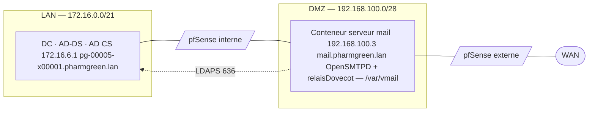

Mise en place de l'environnement d'un serveur de messagerie interne (`pharmgreen.lan`) : préparation de l'hôte, du réseau, du DNS, installation des paquets et préparation système.

> Ce document couvre **l'installation** uniquement. Le paramétrage des services (OpenSMTPD, Dovecot, authentification Active Directory, livraison LMTP, sécurités, validation) est traité dans [`Configuration.md`](Configuration.md).

## Sommaire

- [1. Architecture cible](#1-architecture-cible)
- [2. Prérequis hôte](#2-prérequis-hôte)
- [3. Prérequis réseau](#3-prérequis-réseau)
- [4. DNS sur le contrôleur de domaine](#4-dns-sur-le-contrôleur-de-domaine)
- [5. Installation des paquets](#5-installation-des-paquets)
- [6. Préparation système](#6-préparation-système)
- [7. Vérification post-installation](#7-vérification-post-installation)
- [8. Suite](#8-suite)

---

## 1. Architecture cible



| Élément               |                                                     |
| --------------------- | --------------------------------------------------- |
| Hôte                  | Conteneur LXC en Debian 13 (Trixie)                 |
| IP / masque           | `192.168.100.3/28`                                  |
| Passerelle            | `192.168.100.14` (interface DMZ du pfSense externe) |
| FQDN                  | `mail.pharmgreen.lan`                               |
| Domaine AD            | `pharmgreen.lan`                                    |
| Contrôleur de domaine | `172.16.6.1` — `pg-00005-x00001.pharmgreen.lan`     |
| MTA                   | OpenSMTPD 7.6                                       |
| IMAP / LMTP           | Dovecot 2.4                                         |

> **Choix de placement (DMZ).** Le serveur est en DMZ car il porte le composant destiné à recevoir le flux SMTP entrant (zone exposée). En production, on dissocierait la passerelle SMTP (relais/filtrage, en DMZ) du serveur de boîtes (stockage + authentification annuaire, dans le LAN) pour ne pas exposer les données. Ici les deux rôles sont consolidés, avec un cloisonnement strict des flux DMZ → LAN (LDAPS uniquement).

---

## 2. Prérequis hôte

- Conteneur LXC non privilégié provisionné sur Proxmox, **Debian 13 (Trixie)**.
- Ressources indicatives : 1 vCPU, 512 Mo – 1 Go RAM, 10–12 Go de disque.
- Accès `root` (console Proxmox noVNC ou SSH).
- Système à jour :

```bash
apt update && apt full-upgrade -y
```

- Définir le nom d'hôte (FQDN) :

```bash
hostnamectl set-hostname mail.pharmgreen.lan
```

Vérifier la résolution locale dans `/etc/hosts` :

```ini
127.0.0.1   localhost
192.168.100.3   mail.pharmgreen.lan   mail
```

---

## 3. Prérequis réseau

### 3.1 Sortie Internet du conteneur

La passerelle par défaut est l'interface DMZ du pfSense externe (`192.168.100.14`).

```bash
ip route
ping -c2 1.1.1.1            # connectivité IP
ping -c2 deb.debian.org     # connectivité + résolution DNS
```

> **Double NAT.** Dans la topologie sandwich, le trafic LAN est masqué (NAT) au niveau du pfSense interne : le pfSense externe voit l'IP DMZ du pfSense interne (`192.168.100.1`) comme source, pas l'IP `172.16.x.x` d'origine. À garder en tête pour lire les logs de pare-feu.

### 3.2 Route vers le contrôleur de domaine

Le conteneur route tout vers la passerelle externe (`.14`) mais le DC est derrière le pfSense **interne**. Ajouter une route hôte directe vers le DC :

```bash
ip route add 172.16.6.1/32 via 192.168.100.1
```

Rendre la route permanente dans `/etc/network/interfaces` :

```ini
post-up ip route add 172.16.6.1/32 via 192.168.100.1
```

Vérifier :

```bash
ip route get 172.16.6.1     # doit passer via 192.168.100.1
ping -c2 172.16.6.1
```

### 3.3 Règles pfSense

Ouvrir les flux nécessaires (à créer avec des **alias** pour la lisibilité) :

| Sur firewall            | Source                         | Destination        | Ports                 | Action |
| ----------------------- | ------------------------------ | ------------------ | --------------------- | ------ |
| Interne (interface DMZ) | `Srv_Mail_DMZ` (192.168.100.3) | `Srv_DNS_LAN` (DC) | 389, 636 (LDAP/LDAPS) | Pass   |
| LAN → DMZ               | clients LAN                    | `Srv_Mail_DMZ`     | 143 (IMAP), 25 (SMTP) | Pass   |

> Attention : La règle Pass LDAPS doit être positionnée au-dessus du `Block ... in LAN`.

---

## 4. DNS sur le contrôleur de domaine

Sur le DC (zone `pharmgreen.lan`), créer les enregistrements qui rendent le serveur joignable et le domaine utilisable pour le mail :

| Type | Nom | Valeur | Priorité |
|---|---|---|---|
| A | `mail` | `192.168.100.3` | — |
| MX | `@` (zone) | `mail.pharmgreen.lan` | 10 |

Validation depuis le conteneur :

```bash
nslookup mail.pharmgreen.lan
nslookup -type=mx pharmgreen.lan
```

> En cas d'affichage `Server: UnKnown` dans `nslookup` = absence de PTR (reverse) sur le DC. Aucun impact sur la messagerie.

---

## 5. Installation des paquets

```bash
apt update
apt install opensmtpd dovecot-imapd dovecot-lmtpd dovecot-ldap swaks
```

| Paquet | Rôle |
|---|---|
| `opensmtpd` | MTA (Mail Transfer Agent) — réception et relais SMTP |
| `dovecot-imapd` | serveur IMAP |
| `dovecot-lmtpd` | livraison locale via LMTP (Local Mail Transfer Protocol) |
| `dovecot-ldap` | backend d'authentification LDAP |
| `swaks` | client de test SMTP (Swiss Army Knife for SMTP) |

Outil de test du socket Unix LMTP (utilisé en phase de configuration) :

```bash
apt install netcat-openbsd     # fournit "nc -U" (socket Unix)
```

> Attention depuis **Debian 13** plus de `/var/log/mail.log` par défaut : tout passe par `journald`.
> ```
> journalctl -u opensmtpd -f
> journalctl -u dovecot -f
> ```

---

## 6. Préparation système

### 6.1 Utilisateur et stockage `vmail`

Modèle « utilisateurs virtuels » : un unique compte système possède toutes les boîtes (le détail du modèle est traité dans `Configuration.md`).

```bash
groupadd -g 5000 vmail
useradd  -g vmail -u 5000 -d /var/vmail -m -s /usr/sbin/nologin vmail
chmod -R 770 /var/vmail
```

> **Attention `chmod`.** Bien viser `/var/vmail` (et non `/var/mail`). `vmail` est un compte technique `nologin` (sans shell).

### 6.2 Approbation du certificat (pré-requis LDAPS)

Pour que le serveur fasse confiance au certificat LDAPS du DC, déposer la CA racine (AD CS) dans le magasin de confiance système :

```bash
# CA racine au format PEM, extension .crt obligatoire
cp pharmgreen-ca.crt /usr/local/share/ca-certificates/pharmgreen-ca.crt
update-ca-certificates
```

**Important** : Cette étape installe **la confiance** envers la CA. La configuration de l'authentification LDAP elle-même (compte de service, filtre, passdb/userdb) est faite dans `configuration.md`.

---

## 7. Vérification post-installation

```bash
# Services présents et actifs
systemctl status opensmtpd
systemctl status dovecot

# Versions installées
smtpd -h 2>&1 | head -1
doveconf --version

# Utilisateur de stockage
id vmail
ls -ld /var/vmail

# CA approuvée
ls -l /etc/ssl/certs | grep -i pharmgreen
```

À ce stade : les paquets sont installés, l'utilisateur et le stockage `vmail` sont prêts, la CA interne est approuvée, et les services tournent avec leur configuration **par défaut** (auto-signée, auth PAM locale). L'environnement est prêt à être configuré.

---

## 8. Suite

Passer au paramétrage des services : [`Configuration.md`](Configuration.md)

- Configuration OpenSMTPD (`/etc/smtpd.conf`, utilisateurs virtuels, relais)
- Configuration Dovecot (Maildir, IMAP)
- Authentification Active Directory (LDAPS, compte de service, passdb/userdb)
- Livraison LMTP (OpenSMTPD → Dovecot)
- Sécurités et durcissement
- Validation de bout en bout
