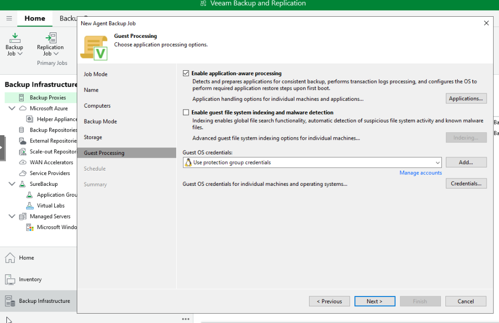
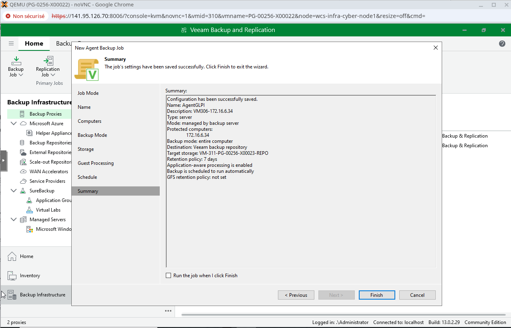
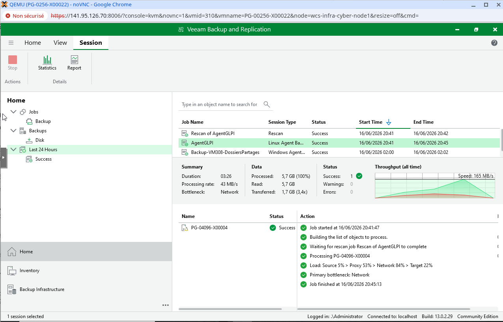

# Configuration | Jobs de sauvegarde Veeam

## 1. Vue d'ensemble

| Job | VM source | OS | Type | Mode | Fréquence | Heure | Rétention |
|---|---|---|---|---|---|---|---|
| Backup-VM308-DossiersPartages | 308 (172.16.6.13) | Windows Server | Agent Windows | File-level backup | Daily | 02:00 | 7 jours |
| AgentGLPI | 306 (172.16.6.34) | Debian 13 | Agent Linux | Entire computer + app-aware | Daily | 03:00 | 7 jours |
| AgentGraylog | 313 (172.16.6.10) | Ubuntu 24.04 | Agent Linux | Entire computer | Weekly | À définir | 7 jours |

**Repository cible** : VM 311 `PG-00256-X00023` | `172.16.6.15` | `E:\Backups` | 64 Go

---

## 2. Job VM 308 | Serveur de fichiers Windows

### Contexte

Le serveur de fichiers (VM 308) héberge le partage `S:\Partage` avec trois arborescences : `Departement/`, `Individuel/`, `Service/`. Ces dossiers sont utilisés quotidiennement par les 211 collaborateurs de Pharmgreen.

### Configuration du job

| Paramètre | Valeur |
|---|---|
| Nom du job | `Backup-VM308-DossiersPartages` |
| Type | Windows Agent Backup |
| Mode | **File-level backup** |
| Cible | `S:\Partage` (Departement, Individuel, Service) |
| Repository | VM 311 `E:\Backups` |
| Fréquence | Daily 02:00 |
| Rétention | 7 jours |

### Justification du File-level

La donnée à protéger = les fichiers utilisateurs, pas l'OS. La VM peut être reconstruite depuis la documentation projet en cas de sinistre complet.

### Agent déployé

L'agent Veeam Agent for Windows est déployé en mode **managed** (poussé automatiquement par le serveur Veeam). Trois services tournent sur la VM 308 :

| Service | Rôle |
|---|---|
| `VeeamDeploySvc` | Réception des commandes du serveur Veeam (install, update) |
| `VeeamEndpointBackupSvc` | Exécution des backups, gestion VSS |
| `VeeamTransportSvc` | Data Mover (transfert des blocs vers le repo sur TCP/6162 TLS) |

### Flux de sauvegarde

```
VM 310 (orchestrateur)
   │  ① ordre de démarrage
   ▼
VM 308 (source)
   ├─ ② VSS snapshot S:\
   ├─ ③ Parcours fichiers + CBT
   └─ ④ Data Mover lit les blocs
          │  TCP/6162 TLS
          ▼
VM 311 (repository)
   └─ ⑤ Data Mover écrit dans E:\Backups\*.vbk
```

---

## 3. Job VM 306 | GLPI + MariaDB

### Contexte

GLPI (VM 306) est l'outil de gestion de parc et de tickets de Pharmgreen. Les données sont stockées dans une base MariaDB 11.8.6. La VM ne dispose que d'une seule partition (`/dev/sda1` montée sur `/`), contenant l'OS, GLPI et la base de données.

### Configuration du job

| Paramètre | Valeur |
|---|---|
| Nom du job | `AgentGLPI` |
| Type | Linux Agent Backup |
| Mode | **Entire computer** |
| App-aware processing | **Activé** (MariaDB) |
| Repository | VM 311 `E:\Backups` |
| Fréquence | Daily 03:00 |
| Rétention | 7 jours |
| Retry | 3 tentatives, 10 min entre chaque |

### Justification du Entire computer

Une seule partition (`/dev/sda1` = `/`) contient tout (OS + GLPI + MariaDB). File-level ou Volume-level n'apportent aucun bénéfice et complexifient la restauration.

### Application-Aware Processing | MariaDB

Veeam gère automatiquement la cohérence de la base MariaDB avant chaque snapshot :

1. L'agent se connecte à MariaDB (port 3306, local)
2. Exécute `FLUSH TABLES WITH READ LOCK` → fige les transactions, flushe les buffers sur disque
3. Le module noyau `blksnap` prend le snapshot des blocs disque
4. L'agent exécute `UNLOCK TABLES` → MariaDB reprend normalement

Durée du freeze : 1-2 secondes. Aucune donnée ne transite via cette connexion, c'est uniquement un ordre de contrôle.

Option choisie : **Require successful processing** → si le freeze échoue, le backup est annulé (pas de backup corrompu silencieux).



### Compte MariaDB dédié (principe de moindre privilège)

```sql
CREATE USER 'veeam-backup'@'localhost' IDENTIFIED BY 'Azerty1*';
GRANT RELOAD ON *.* TO 'veeam-backup'@'localhost';
FLUSH PRIVILEGES;
```

Le compte `veeam-backup` possède uniquement le privilège `RELOAD`, nécessaire pour le `FLUSH TABLES WITH READ LOCK`. Il ne peut ni lire, ni écrire, ni supprimer aucune donnée dans les tables.

### Summary du job



### Premier backup | Validation

| Métrique | Valeur |
|---|---|
| Status | **Success** |
| Date | 16/06/2026 20:45 |
| Durée | 3 min 26 sec |
| Données lues | 5,7 Go |
| Données transférées | 1,7 Go (ratio compression **3,4×**) |
| Erreurs / Warnings | 0 / 0 |



---

## 4. Job VM 313 | Graylog (à déployer)

### Contexte

Graylog (VM 313) centralise les logs de supervision de l'infrastructure. Stack logicielle : Graylog + OpenSearch + MongoDB.

### Configuration prévue

| Paramètre | Valeur |
|---|---|
| Nom du job | `AgentGraylog` |
| Type | Linux Agent Backup |
| Mode | **Entire computer** |
| Repository | VM 311 `E:\Backups` |
| Fréquence | **Weekly** |
| Rétention | 7 jours |

### Justification de la fréquence hebdomadaire

Les logs de supervision sont des données reconstituables par nature : en cas de perte, les équipements supervisés continuent d'émettre de nouveaux logs. Cette fréquence réduite optimise l'espace sur le repository tout en maintenant une protection suffisante.

---

## 5. Stratégie incrémentielle

Veeam utilise le modèle **Forever Forward Incremental** :

| Backup | Type | Fichier | Contenu |
|---|---|---|---|
| 1er | Full | `.vbk` | Tout le disque |
| Suivants | Incrémentiel | `.vib` | Uniquement les blocs modifiés |

À expiration de la rétention (7 jours), Veeam **merge** le plus ancien incrément dans le full pour libérer de l'espace. Le nombre de points de restauration reste constant.

Exemple concret (GLPI) : full = 1,7 Go, incrémentiels quotidiens = ~50 Mo. Coût total sur 7 jours ≈ 2 Go.

---

## 6. Fréquences différenciées | Justification

| Service | Criticité | Fréquence | Justification |
|---|---|---|---|
| Serveur fichiers (VM 308) | **Haute** | Daily 02:00 | Données métier modifiées quotidiennement par 211 utilisateurs |
| GLPI (VM 306) | **Haute** | Daily 03:00 | Tickets et inventaire de parc évoluent en permanence |
| Graylog (VM 313) | **Moyenne** | Weekly | Logs reconstituables, pas de données métier irremplaçables |

Les heures sont décalées (02:00, 03:00) pour éviter la contention sur le repository.

---

## 7. Test de restauration

Un test de restauration a été effectué sur le serveur de fichiers (VM 308) :

1. Suppression d'un dossier dans `S:\Partage\Individuel\U00180\` + vidage de la corbeille
2. Console Veeam → `Backups` → `Disk` → clic droit → `Restore guest files` → `Microsoft Windows`
3. Sélection du point de restauration le plus récent
4. Navigation dans le browser de restauration → sélection du dossier supprimé → `Restore` → `Overwrite`
5. Vérification sur la VM 308 : dossier restauré avec contenu intégral et métadonnées intactes

Durée de la restauration : environ 30 secondes.

> Sans ce test, une sauvegarde n'est qu'une présomption de protection.

---

## Docs de référence

| Sujet | Lien |
|---|---|
| Veeam Agent for Linux | https://helpcenter.veeam.com/docs/agentforlinux/userguide/installation_val.html?ver=13 |
| MySQL Processing | https://helpcenter.veeam.com/docs/agentforlinux/userguide/backup_job_mysql.html?ver=13 |
| File Level Restore | https://helpcenter.veeam.com/docs/backup/agents/guest_restore_windows.html?ver=130 |
