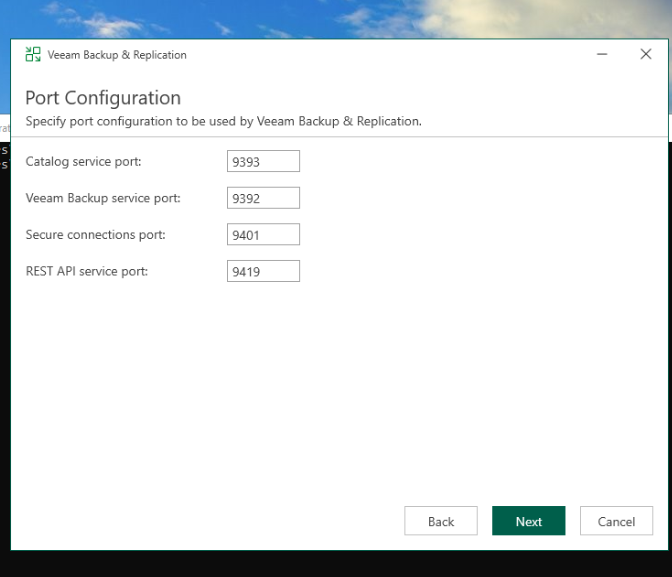
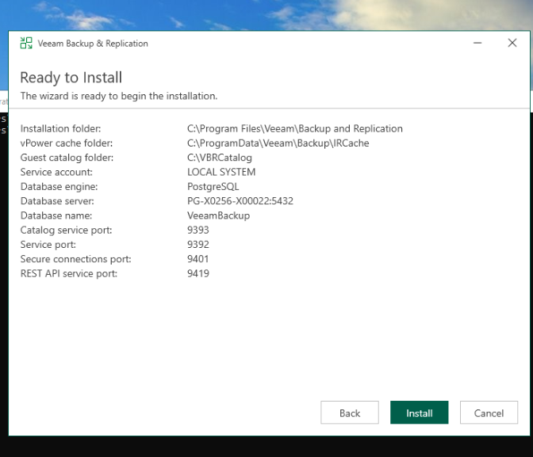
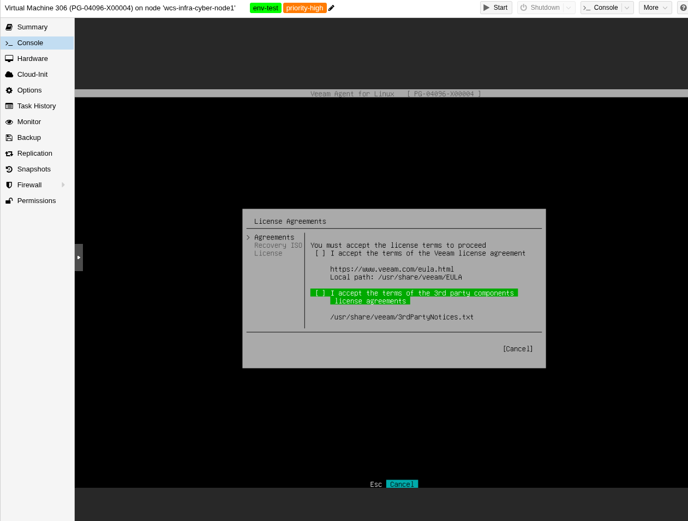

# Installation | Veeam Backup & Replication 13

## 1. Architecture de sauvegarde

| VM | Nom | Rôle | IP | OS |
|---|---|---|---|---|
| 310 | PG-00256-X00022 | Orchestrateur Veeam B&R 13 | 172.16.6.14/27 | Windows Server |
| 311 | PG-00256-X00023 | Référentiel de sauvegarde | 172.16.6.15/27 | Windows Server |

Le référentiel dispose d'un disque dédié de 64 Go monté sur `E:\Backups`, séparé du disque système. Cette séparation garantit qu'un incident sur l'orchestrateur ne compromet pas les sauvegardes existantes.

---

## 2. Installation de Veeam B&R 13 (VM 310)

### Prérequis

- Windows Server avec .NET Framework 4.7.2+
- 4 Go RAM minimum (8 Go recommandé)
- Accès internet pour le téléchargement de l'ISO

### Étapes

1. Téléchargement de l'ISO Veeam Backup & Replication 13 depuis https://www.veeam.com
2. Montage de l'ISO sur la VM 310
3. Lancement de `Setup.exe` → Install Veeam Backup & Replication
4. Acceptation des EULA
5. Composants installés : Veeam Backup & Replication Server, Veeam Backup Console, Veeam Backup Catalog

### Configuration des ports

Les ports par défaut ont été conservés :

| Port | Service |
|---|---|
| 9393 | Catalog service |
| 9392 | Veeam Backup service |
| 9401 | Secure connections |
| 9419 | REST API service |



### Récapitulatif d'installation

| Paramètre | Valeur |
|---|---|
| Installation folder | `C:\Program Files\Veeam\Backup and Replication` |
| vPower cache folder | `C:\ProgramData\Veeam\Backup\IRCache` |
| Guest catalog folder | `C:\VBRCatalog` |
| Service account | LOCAL SYSTEM |
| Database engine | PostgreSQL |
| Database server | PG-X0256-X00022:5432 |
| Database name | VeeamBackup |



### Configuration du référentiel (VM 311)

Après installation, ajout du référentiel de sauvegarde dans la console Veeam B&R :

- `Backup Infrastructure` → `Backup Repositories` → `Add Backup Repository`
- Type : Microsoft Windows
- Chemin : `E:\Backups` sur la VM 311 (172.16.6.15)
- Nom : `VM-311-PG-00256-X00023-REPO`

---

## 3. Installation de Veeam Agent for Linux (VM 306 | GLPI)

> **VM** : 306 `PG-04096-X00004` | Debian 13 | kernel `6.12.90+deb13.1-amd64` | IP `172.16.6.34/28`
> **Build VAL** : `13.0.2.2`

### Étape 1 | Ajout du repo Veeam

Téléchargement du paquet `veeam-release-deb_13.0.2_amd64.deb` (7 KB) depuis :
https://www.veeam.com/products/free/linux-download.html → Debian/Ubuntu | version 13 | x64

Transfert via SCP depuis la VM 310 (PowerShell) :

```powershell
scp $env:USERPROFILE\Downloads\veeam-release-deb_13.0.2_amd64.deb root@172.16.6.34:/root/
```

Installation du paquet release + rafraîchissement du cache :

```bash
sudo dpkg -i veeam-release-deb_13.0.2_amd64.deb
sudo apt update
```

Ce paquet ajoute le repo apt Veeam dans `/etc/apt/sources.list.d/veeam.list` et la clé GPG associée.

### Étape 2 | Installation de l'agent + module noyau

```bash
sudo apt install blksnap veeam
```

Apt tire automatiquement les dépendances (dkms, gcc, make, linux-headers, veeam-libs). DKMS compile les modules `veeamblksnap.ko` et `bdevfilter.ko` pour le kernel actif.



### Étape 3 | Vérification post-install

```bash
systemctl status veeamservice   # active (running)
veeamconfig --version           # 13.0.2.2
```

### Étape 4 | Initial Setup Wizard

```bash
sudo veeam
```

| Étape | Action |
|---|---|
| Step 1 | Accept License Agreements | coché les 2 EULA |
| Step 2 | Recovery ISO | skippé (pas critique sur VM Proxmox) |
| Step 3 | License | Free Edition (Finish sans licence) |

---

## 4. Ports réseau utilisés

| Port | Protocole | Usage |
|---|---|---|
| 6162/TCP | TLS | Data Mover (transfert des blocs de sauvegarde entre agent et repo) |
| 22/TCP | SSH | Déploiement et gestion des agents Linux |
| 9392/TCP | HTTPS | Console Veeam B&R |
| 9393/TCP | HTTPS | Service Catalog |
| 3306/TCP | MySQL | Application-aware processing (freeze MariaDB, local uniquement) |

---

## Docs de référence

| Sujet | Lien |
|---|---|
| Installation Veeam B&R 13 | https://helpcenter.veeam.com/docs/backup/vsphere/install_vbr.html?ver=130 |
| Installation VAL v13 | https://helpcenter.veeam.com/docs/agentforlinux/userguide/installation_val.html?ver=13 |
| Initial Setup VAL | https://helpcenter.veeam.com/docs/agentforlinux/userguide/val_first_steps.html?ver=13 |
